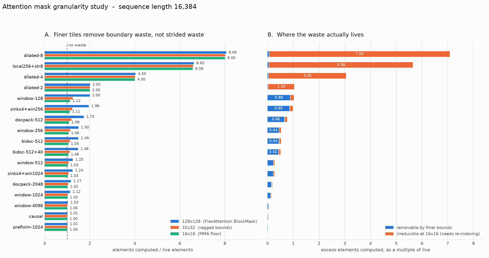

# polyattn — polyhedral analysis of sparse-attention masks

Can a compiler beat a boolean block mask at deciding what attention work to skip?

This repo answers that with exact element counts, validated against brute force.
**Nothing here has been measured on a GPU.** Every number is a proxy for time, not
time — see the limitations below before quoting any of it.

## The finding in one table

Against PyTorch FlexAttention's `BlockMask` (128×128, partial blocks computed in
full), at the 16×16 granularity tensor cores actually floor out at:

Two baselines, because the choice of baseline decides the result. FlexAttention's
`BlockMask` default is 128×128; Binary Block Masking (2024) already runs at 128×32
*and* already applies RCM reordering.

| mask structure | mechanism | vs FlexAttn 128² | **vs BBM (128×32 + RCM)** |
|---|---|---|---|
| pure lattice (dilated) | class A permutation | 2–8× | **1.0× — RCM ties it** |
| union of band + lattice | symbolic class A | 3–5× | **1.6–1.8×** |
| multi-piece column union (sinks) | finer KV tiles | 1.28× | **1.04× — noise** |
| single interval (plain window) | needs *both* tile axes | 1.4–1.8×, **unpriced** | ~1.0× |
| union of differing families | disjoint split + LSE | ×1.05–1.19 | unchanged |
| causal, prefix-LM, window ≥ 1024 | none | 1.0× | 1.0× |

**The right-hand column is the honest one.** One row survives, and it survives for
a specific reason: RCM works on the mask *graph*, and when a local band connects
that graph into one component RCM cannot decompose it — while the *predicate*
still exposes the lattice. Symbolic derivation wins exactly there. It also cannot
regress (it is a minimum over candidates including identity), whereas RCM is a
heuristic that makes `sinks` **worse than doing nothing** (1.59 → 1.77).

Two results worth the reader's attention because they are negative:

- **Finer bounds do nothing for strided masks.** With stride `s` below tile width
  `A`, every `A`-wide tile contains a live element, so nothing is skippable at any
  block size — any stride under the tile width is permanently invisible to
  pruning. That waste (4–8×) is only reachable by *re-indexing*. (The code uses
  `A`=16 as the floor; that is a stand-in for a practical tile width, not a
  hardware constant — see `docs/NOTES.md` §7a. Larger real tiles only widen the
  effect.)
- **Shearing attention windows is a trap.** It drives waste to 1.00 but buys only
  1.12× FLOPs while raising kv rows per tile from 16 to 31 (~1.94× traffic).
  Net loss on a memory-bound kernel.
- **The plain-window result is weaker than it looks.** On the full (BQ, A) product
  grid, refining *either* tile axis alone buys exactly nothing for a
  single-interval mask — window-128 sits at 2.00 waste at 128×128, 128×16 *and*
  16×128, reaching 1.12 only at 16×16. Since small query tiles cost occupancy and
  MMA efficiency and this model prices neither, that 1.78× is a bet, not a result.
  What holds at production tile heights is the multi-piece row above.
  (`docs/NOTES.md` §3a.)



Full reasoning is in [`docs/NOTES.md`](docs/NOTES.md), kept in decision order.
Several headline claims were later falsified and are retained as corrections
rather than edited away — §3a, §3a-bis, §5c, §5d and §5e are the load-bearing
sections, and §7b records how the errors were found.

## Layout

```
src/polyattn/          the library — importable, tested
  masks.py             mask zoo; closed forms for union_cols and live_count
  cost.py              the single cost(BQ, A) all granularity models reduce to
  transforms.py        legal changes of basis + the class A/B cost split
  shapes.py            shape library for the composition search
  figures.py           every figure
  experiments/
    granularity.py     experiment 1 — what block granularity costs
    reindex.py         experiment 2 — which transforms remove it
    compose.py         experiment 3 — one basis per sub-mask
    sampling.py        row-block sampling error measurement
docs/NOTES.md          the reasoning log, in decision order — start here
docs/figures/          generated
notebooks/             the same log, executable, outputs stored
tests/                 400 cases; the closed forms are checked against brute force
results/               generated CSVs
tools/                 notebook generation and execution
```

## Quickstart

```bash
python3 -m venv .venv
.venv/bin/pip install -e ".[dev]"
.venv/bin/python -m pytest                              # 400 cases, ~10s

.venv/bin/python -m polyattn.experiments.granularity    # experiment 1
.venv/bin/python -m polyattn.experiments.reindex        # experiment 2
.venv/bin/python -m polyattn.experiments.compose        # experiment 3, ~2 min
.venv/bin/python -m polyattn.figures                    # regenerate docs/figures

.venv/bin/python tools/build_notebook.py                # regenerate the notebook
.venv/bin/python tools/execute_nb.py                    # run it, store outputs
.venv/bin/jupyter lab notebooks/                        # or just read it
```

## Where to start reading

1. **[`docs/NOTES.md`](docs/NOTES.md)** — the reasoning log in decision order,
   including why mixture-of-experts was assessed and rejected, and a prediction
   that turned out wrong.
2. **[`notebooks/01_reasoning_log.ipynb`](notebooks/01_reasoning_log.ipynb)** — the
   same argument with the numbers computed live.

## Limitations

- **Element counts, not time.** Smaller tiles cost occupancy and MMA efficiency;
  a 1.6× element reduction could land well under 1.6× wall-clock, or negative.
  This is the largest gap in the work.
- The class A permutation's one-time cost, and its interaction with KV-cache
  layout during decode, is argued rather than measured.
- The class B traffic model ignores cache reuse across tiles, so it likely
  overstates the shear penalty.
- Forward attention only. The backward pass has a different access pattern.
- Re-indexing for strided attention is not new *per pattern* — LongNet and Sparse
  Transformer hand-implement it. The claim that survives is deriving the
  transform automatically from an arbitrary predicate.

**Next step is a hand-written Triton kernel**, on two targets: `dilated-8` +
`residue-perm-8` (the strong, free claim) and a `BQ`=16 vs `BQ`=128 window kernel
(the claim §3a puts in doubt). Both convert element counts into wall-clock
numbers, and either could falsify its half of the work. Nothing further should be
modelled before they are measured.
