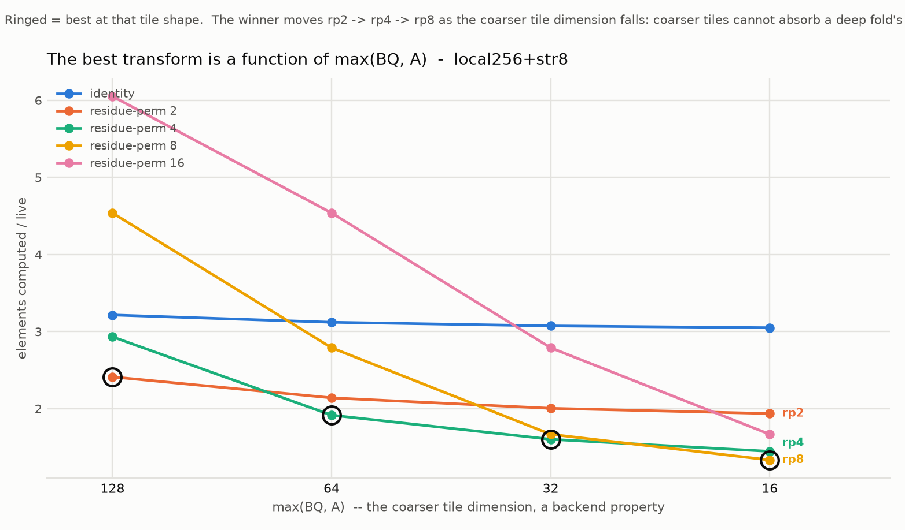

# Polyhedral sparsity for attention — reasoning log

A lab notebook, kept in decision order. Each section records *why* a step was
taken, not only what it produced, so that a wrong turn can be re-litigated
without re-deriving the argument. Numbers quoted here are reproducible from the
scripts in this directory; see §8.

Status as of the last entry: **two mechanisms established analytically, neither
yet measured on hardware.** No GPU claim in this file has been benchmarked.

---

## §0 — The original question

Opening ask: *explore polyhedral sparse optimizations for mixture of experts.*

MoE's FFN, after top-k routing, is a ragged block-diagonal GEMM:

```
for e in 0..E:            # n_e known only at runtime
  for i in 0..n_e:        # ragged
    y[tok[e,i]] += w[e,i] * FFN_e(x[tok[e,i]])
```

Classical polyhedral compilation needs domains bounded by affine functions of
indices and compile-time parameters. `n_e` is a runtime value, so plain
isl/Pluto cannot schedule this. Three ways out were considered:

1. **Sparse Polyhedral Framework** (Strout, Hall, Olschanowsky) — admit
   uninterpreted functions (`expert_offset(e)`, `tok(e,i)`), generate an
   *inspector* that materialises the index arrays at runtime and an *executor*
   that runs the transformed loop.
2. **Union of parametric polyhedra** — treat each `n_e` as a symbolic parameter;
   schedule the union with isl. Simpler; degrades badly when `n_e < tile`.
3. **Capacity-factor padding** — pad to a fixed capacity `C`, making the domain
   a static `[E, C, d]` box. Fully affine, but converts sparsity into predication
   and discards the win. Baseline only.

---

## §1 — Why MoE was rejected

**The deciding argument: inspector-executor pays off when the sparsity pattern's
lifetime greatly exceeds the cost of inspecting it. MoE's routing changes every
batch.** You pay the histogram/sort/prefix-sum on every forward pass and amortise
it over exactly one use. That is the worst case for the entire SPF tradition,
whose canonical wins come from matrices and meshes inspected once and reused for
thousands of iterations.

Two supporting reasons:

- **The sparsity is coarse and dense-within-block.** Each expert's work is a
  large dense GEMM — the regime a tuned grouped GEMM already captures. Polyhedral
  reasoning is least differentiating exactly where the work is.
- **The baselines are industrial.** MegaBlocks, ScatterMoE, Tutel, plus fused MoE
  kernels in vLLM / SGLang / TensorRT-LLM. Beating them is a performance-
  engineering project, not a compiler contribution.

Worth recording: MegaBlocks' histogram + prefix-sum that builds BCSR block
indices *is* a hand-written inspector. Recasting it as SPF is a legitimate
reframing — it just doesn't buy speed, because of the amortisation problem above.

---

## §2 — The ranking lens

Generalising §1 into a reusable criterion. Score a candidate domain on three axes:

| domain | pattern reuse | variant-space size | baseline slack |
|---|---|---|---|
| MoE | very low (1 batch) | medium | low |
| sparse attention | low–medium | **high** | medium |
| GNN (SpMM/SDDMM) | high | high | low–medium |
| irregular-mesh / sparse solvers | **very high** | high | **high** |

Want high on at least two. MoE is high on none.

Two domains were seriously considered against sparse attention and are recorded
here as live alternatives, not discards:

- **Unstructured-mesh PDE solvers.** Best pure fit for the machinery: the mesh is
  fixed for the whole run, so the inspector amortises to nothing. The framing
  would be *"time-tiling transformed structured stencils; unstructured meshes were
  locked out by non-affine connectivity; uninterpreted functions unlock it."*
  Substantial prior art (Strout's sparse tiling; SLOPE/PyOP2/Firedrake from
  Luporini, Ham, Kelly) — the gaps are GPU, automatic rather than annotation-driven
  derivation, MLIR infrastructure, and a cost model for when to tile.
- **Mesh-fixed neural surrogates.** GNN surrogates train thousands of epochs on
  the same mesh graph — mesh-like reuse with an ML audience.

**Chosen: programmable sparse attention.** Deciding reason: unlike MoE, a large
sub-family of attention masks (causal, sliding-window, dilated, strided,
prefix-LM) is a *pure function of position*, hence known at compile time. No
inspector, no amortisation problem — the classical affine regime, where the
tooling is strongest. Only document-packing, learned selection, and KV eviction
need a runtime inspector, and they can be a separately-labelled tier.

The incumbent is PyTorch **FlexAttention**. It accepts an arbitrary `mask_mod`
predicate but prunes at **block** granularity via a precomputed `BlockMask`. It
does distinguish fully-unmasked blocks from partial ones (so it skips *mask
evaluation* on full blocks), but **partial blocks are still computed in full**.
That is the gap under test.

**Known threat, identified before any experiment:** tensor cores impose a hard
granularity floor (MMA is `m16n8k16`-shaped). Exact iteration pruning is
physically unavailable. So the honest ceiling is not "waste eliminated" but
"waste eliminated down to ~16 granularity", and every result below is reported
against a 16-aligned oracle rather than a perfect one.

---

## §3 — Experiment 1: how much does block granularity actually cost?

**Purpose: a cheap kill-test.** Stated in advance: *if the gap between the
128×128 lattice and a 32-aligned ragged model is under ~15% across the zoo, the
idea does not clear the noise floor of kernel tuning and the project stops.*
Pure counting — no GPU, no kernel.

### Design reasoning

The key simplification: **one cost function expresses every model we want to
compare.**

```
cost(BQ, A) = for each query row-block of BQ rows, take the union of live kv
              columns over the rows in that block, cover it with A-aligned
              column segments, and charge BQ * A per covered segment.
```

- `cost(128, 128)` — FlexAttention's BlockMask, including its partial-block waste.
- `cost(BQ, A)` — polyhedral ragged bounds at tile granularity `(BQ, A)`.
- `cost(1, 1)` — the live element count; the unreachable lower bound.
- `cost(16, 16)` — the MMA-shaped physical floor, and therefore the real target.

Because the three models are one function at different granularities, the
comparison cannot be rigged by modelling the baseline unfavourably.

Covering the union with *A-aligned segments* (rather than an interval hull)
matters: it keeps the model honest for strided masks, whose live set per row is
not contiguous. An interval-hull model would have overstated the baseline's waste.

### Implementation notes

- Each mask supplies closed forms for `union_cols(q0,q1,N)` and `live_count(N)`,
  keeping the sweep O(N²/BQ) instead of O(N²). `test_masks.py` validates every
  closed form against a brute-forced dense mask at N=256 and 512, including the
  identity `cost(1,1) == live`. All pass.
- Row-blocks are sampled (512 evenly spaced) above 512 blocks. `check_sampling.py`
  measures the resulting error against exact enumeration: **≤0.46%**, worst case
  docpack at 16×16. Negligible for the ratios reported.

### Results (see `granularity.png`, `results.csv`)

Gain of ragged bounds over BlockMask, stable across N = 4K–64K:

| regime | gain @32×32 | gain @16×16 |
|---|---|---|
| window-128, sinks+win256 | **1.60×** | 1.78× |
| docpack-512 | 1.47× | 1.61× |
| window-256 | 1.33× | 1.41× |
| window-512, sinks+win1024 | 1.18× | 1.21× |
| causal, prefix-LM, window ≥1024 | 1.00–1.01× | 1.03× |
| **dilated-2/4/8, local+strided** | **1.00–1.03×** | 1.03× |

### The finding, including a wrong prediction

**Predicted ~2× for dilated masks. Actual: 1.00–1.03×, i.e. nothing** — while
BlockMask simultaneously wastes 4× to 8× on them. That waste is real and is
completely untouchable by finer bounds.

The reason is clean and generalises: **with stride `s` smaller than tile width
`A`, every `A`-wide column tile contains a live element, so no tile is skippable
at any granularity ≥ `s`.** Tensor cores floor `A` at 16, so any stride below 16
is permanently invisible to pruning, at any block size.

Panel B of `granularity.png` decomposes the excess into what finer bounds recover
and what no amount of pruning can. For dilated-8 the split is 0.06 / 7.00.

**Conclusion: the kill-test passes for the window and doc-packing regimes
(1.4–1.8×, comfortably over the 15% threshold), fails for everything else — and
relocates the interesting problem.** Pruning is the wrong verb for the strided
family.

---

## §3a — Correction: experiment 1 measures the wrong axis

*Added after a peer novelty review flagged that `sweep.py` only tests **square**
grains (128², 64², 32², 16²). It does, and separating the two knobs changes what
§3 means. Verified independently on the (BQ, A) product grid,
`experiments.granularity.product_grid`, N=16384:*

| mask | 128×128 | 128×16 | 16×128 | 16×16 |
|---|---|---|---|---|
| window-128 | 2.00 | **2.00** | **2.00** | 1.12 |
| window-256 | 1.50 | **1.50** | **1.50** | 1.06 |
| window-512 | 1.25 | **1.25** | **1.25** | 1.03 |
| sinks4+win256 | 1.96 | **1.54** | 1.96 | 1.11 |
| docpack-512 | 1.73 | **1.51** | 1.50 | 1.08 |
| dilated-8 | 8.06 | 8.06 | 8.06 | 8.00 |

**For a mask whose per-row-block union is a single interval, refining *either*
axis alone buys exactly nothing.** The arithmetic is immediate once separated:
the union over `BQ` query rows of a width-`w` window spans `w + BQ − 1`
contiguous columns, and the cost is that span rounded up to `A`. With `BQ`=128
the span is already ≈2w, so tightening `A` cannot help; with `A`=128 the rounding
swallows the gain from a small span. Only shrinking **both** reaches 1.12.

This matters because **shrinking `A` is nearly free while shrinking `BQ` is not** —
small query tiles cost occupancy, MMA efficiency and per-tile softmax statistics,
which is precisely the cost this model does not price. So the 1.4–1.8× headline in
§3 is not a ragged-column result: it is a *joint* tile-shrink result that is
mostly a bet on small query tiles surviving a real kernel. That bet is unproven
and the odds are not obviously good.

**One refinement to the review's version of this.** It stated the win "comes from
shrinking BQ". That is not what the data shows: BQ alone at A=128 is also flat
(2.00 → 2.00). Neither axis alone does anything for single-interval masks; the
effect is strictly joint.

**What survives as genuine KV-axis content:** masks whose per-row-block union is
**multi-piece** — `sinks4+win256` (1.96 → 1.54) and `docpack-512` (1.73 → 1.51)
at production `BQ`=128. Covering a union of disjoint affine pieces is the real
polyhedral operation here, and against FlexAttention's default it is worth
1.15–1.28×, not 1.6–1.8×.

**§3a-bis — and against a realistic incumbent it is worth nothing.** Binary Block
Masking (arXiv:2409.15097, 2024) runs at a tile of **(128, 32)**, not 128×128.
Re-reading the same product grid against *that* column:

| mask | FlexAttn 128×128 | BBM 128×32 | ours 128×16 | headroom vs BBM |
|---|---|---|---|---|
| sinks4+win256 | 1.96 | 1.60 | 1.54 | **1.04×** |
| docpack-512 | 1.73 | 1.55 | 1.51 | **1.02×** |
| sinks4+win1024 | 1.24 | 1.15 | 1.14 | **1.01×** |

1–4% is noise. **Mechanism 2 does not survive contact with a published 2024
baseline** and should not be presented as a contribution. Comparing only against
FlexAttention@128×128 would have been picking the weakest available opponent.
What remains of §3 is diagnostic value — a map of where waste lives — not a
method.

**Consequences, carried into §6 and §7:**

- Mechanism 2 should be restated as *multi-piece column covering at fixed BQ*,
  1.15–1.28×. The single-window claim should be dropped.
- Mechanism 1 (§4) is untouched: it is a class A permutation at fixed tile size
  and does not depend on shrinking anything.
- The Triton kernel moves to the front of §7 — query-tile cost is now the pivot of
  the entire mechanism-2 claim, and it can only be settled by measurement.

---

## §4 — Experiment 2: re-indexing

**Hypothesis:** the strided waste is untouchable by pruning but removable by a
*change of basis*. A strided live set is an affine lattice; the right transform
makes it contiguous, turning a mask that is 8× wasteful into a dense small matmul.
BlockMask is a boolean predicate over a *fixed* lattice and cannot express this
even in principle.

### Deriving the legal transform family

The search space is not all of GL₂(ℤ). Attention reduces over kv at fixed q:

```
out[q] = sum_kv softmax(S[q,kv]) V[kv]
```

so a transform must not mix q into the reduced axis in a way that breaks the
fibration over q. That leaves:

```
q'  = pi_q(q)                # any permutation of queries — free, undone on output
kv' = pi_kv(kv)              # CLASS A: q-independent relabelling of keys
kv' = (kv - a*q) / s         # CLASS B: q-dependent shear / stride-fold
```

**The criterion is the SHAPE OF THE ROW INDEX, which is sharper than
amortisability and is derivable from the predicate.** §4 originally justified the
split by *where* the cost falls (once per layer vs per tile). The index-shape
argument says *why the cost exists at all*:

| transform | row index | consequence |
|---|---|---|
| `kv' = π(kv)` | **vector** `[A]` | K shared across all query rows of a tile |
| `kv' = (kv − aq)/s` | **matrix** `[BQ, A]` | K cannot be shared; working set ×BQ |

That is checkable from the transform's algebra — `a = 0` gives a vector index,
`a ≠ 0` gives a matrix — so it is **selector-visible** rather than an
implementation observation. It is also why class B is a different *kernel* rather
than a flag, and why every class B number in this project is a traffic count:
**class B has never been executed here, only modelled.**

**The two classes have completely different costs, and this turned out to be the
decisive distinction:**

- **Class A** — the permuted K/V tensor is materialised **once per layer**,
  O(N·d) traffic, after which every tile is rectangular and contiguous.
  Effectively free.
- **Class B** — every tile needs a different slice of K/V, so the gather cannot
  be amortised. A `BQ × A` tile touches `A + a·(BQ−1)` distinct kv rows instead
  of `A`. FLOPs down, traffic up.

Transforms tested: `identity`; `shear` (kv′ = kv − q, straightens a diagonal
band); `residue-perm-s` (Class A — sort *both* axes by `(i mod s, i div s)`,
which turns `kv ≡ q (mod s)` into s independent dense blocks); `stridefold-s`
(Class B — kv′ = (q−kv)/s, same target, q-dependent). Computed exactly on a
materialised 4096² mask — no closed forms, no sampling. Element count is asserted
preserved by every transform.

### Results (see `reindex.png`, `reindex.csv`), at 16×16

| mask | best legal transform | class | waste after | FLOP gain | kv/tile | free? |
|---|---|---|---|---|---|---|
| dilated-8 | residue-perm-8 | A | **1.03** | **7.79×** | 16 | yes |
| dilated-4 | residue-perm-4 | A | 1.01 | 3.95× | 16 | yes |
| dilated-2 | residue-perm-2 | A | 1.01 | 1.99× | 16 | yes |
| local256+str8 | residue-perm-8 | A | 1.24 | 3.49× | 16 | yes |
| window-128 | shear | B | 1.00 | 1.12× | **31** | **no** |
| window-256 | shear | B | 1.00 | 1.06× | 31 | no |
| sinks4+win256 | identity | — | 1.11 | 1.00× | 16 | — |
| docpack-512 | identity | — | 1.08 | 1.00× | 16 | — |
| causal | identity | — | 1.00 | 1.00× | 16 | — |

### What this establishes

1. **The hypothesis holds, via the free class.** dilated-8's 8× waste collapses
   to 1.03 under a *static, q-independent* permutation that keeps tiles
   contiguous. This is what LongNet does by hand for its own pattern; here it
   falls out as a derived transform.
2. **Shear is a trap.** It drives window masks to waste 1.00, but buys only
   1.12× FLOPs while raising kv rows per tile from 16 to 31 (≈1.94× traffic).
   For a memory-bound kernel that is a **net loss**. Recorded as a negative
   result: do not shear attention windows.
3. **The two winning mechanisms are disjoint and composable**, and each covers
   the regime the other cannot:
   - strided / dilated → Class A permutation (free), 2–8×
   - small window, sinks, doc-packing → ragged affine bounds, 1.4–1.8×
   - causal, prefix-LM, large window → already optimal, 1.0×
4. **Composition is an open problem, and it shows.** `local256+str8` reaches only
   1.24 — the residue permutation that fixes its strided component scatters its
   local-window component. A mask that is a *union* of sub-masks may need each
   term in its own basis.

---

## §5 — Experiment 3: composition

Experiment 2 left exactly one failure: `local256+str8` stalled at **1.24** under
any single transform, because the residue permutation that makes its strided
component dense *scatters* its local-window component. The two components want
different bases — so give each its own.

### Why this is legal

Attention over a mask that is a **disjoint** union `M = P1 + P2` can be computed
as separate attentions over `P1` and `P2` merged with the standard online-softmax
(log-sum-exp) combine — the same mechanism flash-decoding and ring attention
already use to split the kv axis. **Disjointness is essential**: an element
counted in two parts would be double-counted in the softmax denominator. Every
decomposition is peeled to be disjoint by construction, and the union is asserted
to reconstruct `M` exactly.

### Search design

A library of 12 shapes (bands, lattices, prefixes, full-causal), all subsets up to
size 3, peeled in a canonical order (bands, then lattices, then prefixes) so each
element lands in the most tile-dense home available. Non-reconstructing
decompositions are rejected. Class B (shear) is excluded throughout.

Two methodology fixes were needed before the numbers meant anything, both worth
recording because both inflated the result:

- **The `k=1` baseline must be offered every class-A transform**, not only the one
  its shape suggests. Without that, the single-basis row was artificially weak and
  the reported gain came out 1.86× instead of the true 1.19×.
- **Both baseline and result must be verified at the same N.** The first version
  compared a search-size (N=1024) single-basis number against a verified (N=4096)
  decomposition. Fixed; all figures below are N=4096.

### Results

| mask | best single basis | decomposed | parts | gain | merge cost |
|---|---|---|---|---|---|
| local256+str8 | 1.245 | **1.048** | 2 | 1.19× | 0.54% |
| local128+str4 | 1.090 | 1.038 | 2 | 1.05× | 1.59% |
| sinks4+win256 | 1.106 | 1.106 | 1 | 1.00× | — |
| dilated-8 | 1.029 | 1.029 | 1 | 1.00× | — |
| window-128 | 1.125 | 1.125 | 1 | 1.00× | — |
| causal | 1.004 | 1.004 | 1 | 1.00× | — |

The winning split for `local256+str8`: `band-256` in the identity basis (waste
1.062) plus `lattice-8` under `residue-perm-8` (waste 1.031).

### What this establishes

1. **The open failure closes.** Against BlockMask's 4.46 this is now a **4.26×**
   total reduction — of which Class A supplied 3.6× and composition the final
   1.19×. Proportion matters: composition is the *closer*, not the headline.
2. **The merge is cheap** — ~0.5% of the work it buys on `local256+str8`. This is
   an order-of-magnitude estimate converting traffic into FLOP-equivalents, not a
   measurement, but it is not close enough to 100% for the conclusion to be at
   risk.
3. **Composition helps only genuine unions.** Four of six masks gain nothing.
   `sinks4+win256` is the instructive negative: peeling off its 4-wide sink prefix
   costs more than it saves, because 4 columns still occupy a full 16-wide tile.
   **A sub-mask narrower than the MMA granularity should never be peeled off** — a
   rule the eventual cost model must encode.
4. **The space is now three mechanisms**, and which applies is a property of the
   predicate:

   | mask structure | mechanism | vs FlexAttn@128² | vs BBM (128×32 + RCM) |
   |---|---|---|---|
   | pure lattice (dilated) | class A permutation | 2–8× | **1.0× — RCM ties** |
   | union of band + lattice | symbolic class A | 3–5× | **1.6–1.8×** |
   | multi-piece column union (sinks) | finer KV tiles | 1.28× | **1.04× — noise** |
   | single interval (window) | both tile axes — §3a | 1.4–1.8×, unpriced | ~1.0× |
   | union of differing families | disjoint split + LSE | +1.05–1.19× | unchanged |
   | causal, prefix-LM, large window | none | 1.0× | 1.0× |

   **The right-hand column is the one to write down.** Only one row survives a
   realistic incumbent, and the reason it survives is connectivity (§5a).

   Selecting among them automatically from the predicate alone is the compiler
   contribution. **This table is its specification.**

---

## §5a — Experiment 4: symbolic re-indexing vs RCM

Binary Block Masking's third technique is **Reverse Cuthill–McKee reordering of
the mask matrix**, applied before the kernel, explicitly to concentrate scattered
non-zeros so fewer tiles are occupied. That is class A re-indexing, published in
September 2024. It was sitting in §7 as *future work* ("bandwidth-reducing
permutations, RCM-style"). It is not future work; it is the incumbent, and
mechanism 1 has to beat it or explain why it does not apply.

`polyattn.reorder` implements RCM directly — George–Liu pseudo-peripheral start,
components handled in turn — so the baseline is the real algorithm rather than a
strawman. Head-to-head at N=2048, `experiments.rcm_vs_symbolic`:

| mask | grain | identity | symbolic | RCM | outcome |
|---|---|---|---|---|---|
| dilated-2 | 16×16 | 2.014 | 1.015 | 1.015 | **tie** |
| dilated-4 | 16×16 | 4.023 | 1.029 | 1.029 | **tie** |
| dilated-8 | 16×16 | 8.031 | 1.058 | 1.058 | **tie** |
| local256+str8 | 128×32 | 3.214 | 2.411 | 4.431 | **symbolic 1.84×** |
| local256+str8 | 16×16 | 3.049 | 1.332 | 2.154 | **symbolic 1.62×** |
| sinks4+win256 | 128×32 | 1.585 | 1.585 | 1.765 | symbolic 1.11× (RCM regresses) |
| docpack-512 | 128×32 | 1.565 | 1.565 | 1.524 | RCM 1.03× |
| window-128, causal | both | — | — | — | tie, all identity |

**Three findings, and the first one hurts.**

1. **On a pure lattice, RCM matches symbolic exactly.** Not approximately —
   identically, to three decimals. The reason is structural: the symmetrised graph
   of a stride-`s` mask has exactly `s` connected components, one per residue
   class, and RCM lays components out contiguously. So the dilated headline of §4
   is *reachable by a published heuristic that knows nothing about the predicate*.
   Mechanism 1's strongest single number is not novel against BBM.
2. **On a union mask, symbolic wins decisively and RCM actively harms.**
   `local256+str8`: symbolic 1.33, RCM 2.15, identity 3.05 at 16×16 — and at
   128×32 RCM (4.43) is *worse than doing nothing* (3.21). The band connects the
   graph into one component, so RCM cannot decompose it; the predicate still
   exposes the lattice. **This is the surviving claim for mechanism 1**, and it is
   about connectivity, not about strides.
3. **RCM regresses on structured masks** (`sinks`: 1.585 → 1.765). It is a
   heuristic with no guarantee. Symbolic selection is a minimum over candidates
   including identity, so it *cannot* regress.

**This reframes the contribution rather than removing it.** Finding 3 is the
strongest argument yet for the item that was already ranked first — a *selection*
cost model. A single fixed strategy ("always RCM") is worse than nothing on 2 of
8 masks here. The contribution is not a transform; it is knowing which transform,
from the predicate, without materialising anything.

The claim must narrow accordingly: not "re-indexing attention masks to raise
block density" — taken, twice, by RCM and by PBS-Attn — but **"deriving the
permutation symbolically from the predicate rather than numerically from the
matrix, which wins exactly when the mask's graph is connected but its predicate
is not."**

---

## §5b — Experiment 5: selection depends on the tile shape

This was sitting in experiment 4's own output and I missed it; a peer review
pulled it out. For `local256+str8` the *winning transform* — not the winning
margin — changes with the tile shape.



`experiments.grain_dependence`, N=2048, waste at each tile shape, `*` = argmin:

| transform | 128×128 | 128×32 | 64×16 | 32×32 | 16×16 |
|---|---|---|---|---|---|
| identity | 3.214 | 3.214 | 3.120 | 3.072 | 3.049 |
| residue-perm-2 | **2.411\*** | **2.411\*** | 2.139 | 2.003 | 1.935 |
| residue-perm-4 | 2.931 | 2.505 | **1.914\*** | **1.601\*** | 1.445 |
| residue-perm-8 | 4.538 | 3.545 | 2.292 | 1.666 | **1.332\*** |
| residue-perm-16 | 6.050 | 6.050 | 3.545 | 2.789 | 1.666 |

The argmin moves across **three** transforms: rp2 → rp4 → rp8. `local128+str4`
does the same (rp2 → rp4).

**There is a law here, but §5c corrects what variable it is over.** The sequence
above moves *both* tile axes at once — the same confound §3a caught, recurring one
level up. The driving variable is `max(BQ, A)`, not fineness. See §5c.

### Why this is the load-bearing result

Selection is **not a function of the predicate**. It is a function of
*(predicate, tile shape)* — and tile shape is a backend and hardware property,
not a property of the mask. Therefore:

- **No per-pattern hand implementation can do it.** LongNet and Sparse
  Transformer bake one basis in at authoring time; they cannot re-derive it when
  the tile shape changes or the code moves to different hardware.
- **RCM cannot do it.** Graph bandwidth has no tile-shape input at all.
- **A static per-family lookup table cannot do it** — which is exactly what makes
  a compiler necessary rather than decorative. If selection were
  grain-independent you could ship the table and skip the compiler.

The RCM regressions (§5a) argue selection is *safer*. This argues selection is
*necessary*. That is a stronger claim and it is the one to lead with.

### The grain-dependence is confined to union masks

`dilated-8` picks rp8 at every tile shape; `sinks4+win256` picks identity at every
tile shape. Only the union masks move. **The same structural property —
a predicate that decomposes over a graph that does not — explains both where
symbolic beats RCM (§5a) and where selection is grain-dependent.** One condition,
two consequences.

### A prediction of the review that the data falsified

The review predicted RCM's damage would be *flat* across grains, which would show
its objective has no tile-shape input. Measured, the damage ratio
(RCM waste / identity waste) is strongly grain-dependent:

| mask | 128×128 | 128×32 | 64×16 | 32×32 | 16×16 |
|---|---|---|---|---|---|
| local256+str8 | 1.824 | 1.379 | 1.002 | 0.808 | 0.706 |
| sinks4+win256 | 1.172 | 1.114 | 1.070 | 1.067 | 1.037 |
| dilated-8 | 0.176 | 0.176 | 0.152 | 0.138 | 0.132 |

RCM is harmful at coarse tiles and *helpful* at fine ones on `local256+str8`. The
underlying diagnosis survives in a sharper form: since the optimum is itself
grain-dependent, any method that does not take grain as input **cannot** be right
across grains — its error drifts uncontrollably rather than staying constant. RCM
is not optimising badly; it is optimising without the parameter that determines
the answer.

---

## §5c — Correction: the variable is max(BQ, A), and the condition is diagonal invariance

*§5b's law was stated over a sequence that moves both tile axes at once. A peer
review caught it — third axis-confound of the project, and I made the same
mistake §3a exists to warn about. Tested on the full product,
`experiments.tile_shape_law`, N=2048.*

`local256+str8`, argmin transform (waste) per cell, **at N=2048** — the argmin
also moves with `N`, see §5i:

| BQ \\ A | 128 | 64 | 32 | 16 |
|---|---|---|---|---|
| **128** | rp2 (2.41) | rp2 (2.41) | rp2 (2.41) | rp2 (2.41) |
| **64** | rp2 (2.41) | rp4 (1.91) | rp4 (1.91) | rp4 (1.91) |
| **32** | rp2 (2.41) | rp4 (1.91) | rp4 (1.60) | rp4 (1.60) |
| **16** | rp2 (2.41) | rp4 (1.91) | rp4 (1.60) | rp8 (1.33) |

Read the anti-diagonals: **waste is a function of `max(BQ, A)` alone** — every
cell with max=128 gives 2.41 and picks rp2, max=64 gives 1.91 and rp4, max=32
gives 1.60, max=16 gives 1.33 and rp8. Measured spread within each max class:
**0.000**. Symmetry `|w(BQ,A) − w(A,BQ)|`: **0.000**.

§5b's progression was right because its max values happen to run 128, 128, 64,
32, 16 — "finer tiles" was a proxy that tracked the real variable along that one
path.

### The condition, which is sharper than "lattice-structured"

The review attributed symmetry to lattice structure. That is not it —
`local256+str8` is a *union* mask and is still perfectly symmetric. The actual
condition is **diagonal translation invariance: the mask depends only on
`q − kv`.**

| mask | depends only on q−kv | symmetry | max-law |
|---|---|---|---|
| local256+str8 | yes | 0.000 | holds |
| dilated-8, dilated-4 | yes | 0.000 | holds |
| window-128, causal | yes | 0.000 | holds |
| sinks4+win256 | **no** (`kv < g` is absolute) | 0.374 | fails |
| docpack-512 | **no** (boundaries are absolute) | 0.137 | fails |

**§5e supersedes this section's central claim.** Diagonal invariance gives
symmetry (now a theorem) but *not* the max-law; the law holds under the narrower
ALIGNED-AND-SEPARATED condition, which every mask in the original zoo satisfied by
construction. The table below is retained as the record of what was measured, not
as a live claim. The proof looks
reachable (transposing the tile shape should map a diagonally-invariant problem
to itself) and is worth doing, since a proved condition is checkable in closed
form from the predicate and therefore feeds the selection model directly.

### Why this helps the cost model more than the table did

A function of `max(BQ, A)` is a **one-dimensional input**. For a
diagonally-invariant mask the selection rule reduces to picking a fold depth from
a single scalar — a cost model with *structure*, not a lookup table with a caveat.
The compiler claim becomes concrete: the backend reports one number and selection
is determined.

It is also §3a's lesson recurring, and should be stated once as a structural
property rather than twice as separate observations: **a quantity that is a
function of `max(BQ, A)` is exactly one where shrinking a single axis buys
nothing** — the other axis pins the answer. *(§5e scopes this: it applies to the
aligned case only.)* §3a found that for the granularity
model; §5c finds it again for transform selection.

### A second prediction of the review that the data falsified

The review predicted RCM's damage would straighten once indexed by `max(BQ, A)`.
The mean does fall monotonically (1.521, 1.065, 0.803, 0.706) but the **spread
within each max class is large** — ±0.458 at max=128, ±0.239 at max=64. So RCM
damage is *not* a function of max, even for a mask whose optimum is.

The mechanism is worth more than the correction. Measured symmetry of the mask
*after* RCM reordering:

| mask | symmetry before | after RCM |
|---|---|---|
| local256+str8 | 0.000 | **0.242** |
| dilated-8, window-128, causal | 0.000 | 0.000 |
| sinks4+win256 | 0.374 | 0.374 |

**The surprising part is the selectivity:** RCM leaves the property intact on
`dilated-8`, `window-128` and `causal`, and destroys it only on `local256+str8` —
exactly the mask where it does harm. (That an arbitrary row/column permutation
breaks diagonal invariance *somewhere* is near-tautological; that it breaks it
precisely where it hurts is not.) So RCM does not merely fail to consume the tile
parameter; it demolishes the structural property that makes the problem
one-dimensional in the first place.
That is a stronger indictment than "optimising the wrong objective", and it is
the cleanest statement yet of why a symbolic, structure-preserving transform is
worth having.

---

## §5d — Correction: two false positives, and symmetry is not the max-law

*A peer review pointed out that §5c's condition is sufficient, not necessary, and
that its evidence table contains vacuous passes. Both correct. Tested with two
constructed masks — bidirectional attention within packed documents, one with
boundaries deliberately offset off the tile grid — now added to the zoo as
`BidirectionalDocPacked`, since encoder fine-tuning and embedding-model training
are a real workload rather than a thought experiment.*

| mask | Toeplitz | M = Mᵀ | cost symmetry | max-law | waste@128² | vacuous? |
|---|---|---|---|---|---|---|
| local256+str8 | yes | no | 0.000 | holds | 2.411 | no |
| dilated-8 | yes | no | 0.000 | holds | 1.494 | no |
| sinks4+win256 | no | no | 0.374 | fails | 1.905 | no |
| docpack-512 | no | no | 0.137 | fails | 1.765 | no |
| **prefixlm-1024** | no | no | 0.000 | holds | **1.025** | **YES** |
| **causal** | yes | no | 0.000 | holds | **1.062** | **YES** |
| **bidoc-512** | no | **yes** | **0.000** | **fails** | 1.502 | no |
| **bidoc-512+40** | no | **yes** | **0.000** | **fails** | 1.343 | no |

### 1. The vacuity screen — the review is right

`prefixlm-1024` is neither Toeplitz nor symmetric yet reads 0.000. It passes
because it is nearly dense: waste 1.025 at every tile shape, so there is nothing
for the metric to separate. `causal` is the same at 1.062. **Any near-dense mask
passes a tiling-symmetry test vacuously**, and for such masks the selection
question is moot anyway. §5c's "perfect separation across six masks" was really
four masks plus two free passes. Screen on `waste@128² < 1.10` before counting a
mask as evidence. Note the threshold is N-dependent — causal is 1.12 at N=1024 and
1.06 at N=2048 — so screen at the N the claim is made at.

### 2. Symmetry is a second sufficient condition — but for a *weaker* property

The review proposed `M = Mᵀ` as an independent route to the max-law. Half right,
and the half that fails is the important half.

`bidoc-512` is perfectly symmetric and its **cost symmetry is exactly 0.000** — so
`M = Mᵀ` does give tile-shape symmetry, via `cost(BQ,A)` on `M` equalling
`cost(A,BQ)` on `Mᵀ`. But its **max-law spread is 0.223** at max=128 (0.092 at 64,
0.030 at 32). The offset variant behaves the same (0.149 at max=128), so this is
not an alignment artefact.

**Symmetry in (BQ, A) is strictly weaker than being a function of max(BQ, A).**
`f(BQ,A) = BQ + A` is symmetric and is not a function of max. The measured cells
show exactly that shape: `bidoc-512` runs 128×128 = 1.502, 128×64 = 1.368,
128×32 = 1.306 — symmetric across the diagonal, but still falling as the *finer*
axis shrinks, which a function of max cannot do.

So the corrected hierarchy is:

| condition | predicate-checkable | gives cost symmetry | gives the max-law |
|---|---|---|---|
| diagonal invariance (depends only on q−kv) | yes | yes | **yes** |
| M = Mᵀ | yes | yes | **no** |
| near-dense (waste ≈ 1) | yes | vacuously | vacuously |

**The one-dimensional selection rule needs the max-law, so it applies to
diagonally-invariant masks only.** Bidirectional packed documents get symmetry but
not the scalar rule — they need the full 2-D grid. That narrows the reach of the
§5c result and should be stated as a limitation, not folded in as a second win.

**And the limitation bites hardest where it matters.** The within-class spread
shrinks monotonically as tiles get finer — measured across four `bidoc` variants
(different mean lengths, seeds, and boundary offsets):

| mask | max=128 | 64 | 32 | 16 |
|---|---|---|---|---|
| bidoc-256 | 0.266 | 0.114 | 0.031 | 0.000 |
| bidoc-512 | 0.223 | 0.092 | 0.030 | 0.000 |
| bidoc-512+40 | 0.149 | 0.059 | 0.015 | 0.000 |
| bidoc-2048 | 0.035 | 0.003 | 0.001 | 0.000 |

So for a symmetric-but-not-invariant mask the max-law is *approximately* true at
fine grains and *badly wrong* at coarse ones. Real kernels run `BQ`=128, so a
scalar rule misapplied here would err most in the regime that matters — a
load-bearing limitation, not a corner case. The error also shrinks with document
length (bidoc-2048 is nearly compliant at 0.035), so it is worst for short
documents relative to the tile.

### 3. On the RCM phrasing

The review is right that what §5c measured is loss of *cost* symmetry, and that
inferring loss of diagonal invariance from it is near-tautological for an
arbitrary row/column permutation. **The load-bearing part is the selectivity:**
RCM leaves the property intact on `dilated-8`, `window-128` and `causal`, and
destroys it only on `local256+str8` — exactly where it does harm. §5c now leads
with that.

---

## §5e — Falsification: §5c's law is false; its symmetry half is a theorem

*A third session (adversarial verification) broke both C2 and C3. Every number
below reproduced independently in this session before being written down.*

### The symmetry half is a theorem — but not by the counting argument

**First version of this section was wrong, and my verification of it was
rigged. Kept visible because the failure is instructive.** The argument I
originally wrote — reorganise cost as `g · |gZ ∩ F(BQ,A)|` with
`F(BQ,A) = D + [−(A−1), BQ−1]`, then use `F(A,BQ) = F(BQ,A) − (BQ−A)` as a
bijection of `gZ` — assumes every diagonal offset `v` contributes **equally**.
It does not. The correct reorganisation weights each offset:

```
cost = BQ·A · Σ_{v ∈ gZ, v live} n(v),
n(v) = #{ x : x ≡ 0 mod BQ, x ≡ −v mod A, max(0,−v) ≤ x < min(N, N−v) }
```

`n(v)` counts the tile pairs realising offset `v`, and it falls off as `|v|`
grows — there are simply fewer tile pairs at a large diagonal offset. It is
`≈ N/lcm(BQ,A)` uniformly **only when `|v| ≪ N`**. The bijection does not preserve
the weight, so it does not finish the proof.

Measured, unweighted form ÷ true cost:

| mask | N=2048 | 4096 | 8192 | |
|---|---|---|---|---|
| window-128 (bounded D) | 1.0323 | 1.0159 | 1.0079 | → 1, error halving |
| twoband-128+1024 (span 1151) | 1.3913 | 1.1636 | 1.0756 | → 1 |
| **causal** (span 8191) | **2.0000** | **2.0000** | **2.0000** | **stuck** |
| **dilated-8** | **2.0000** | **2.0000** | **2.0000** | **stuck** |
| **local256+str8** | **2.0000** | **2.0000** | **2.0000** | **stuck** |

The 2.000 is structural: for triangular support the live `m` saturate the range
but the live tiles average half a block-row, so the unweighted count doubles it.
Causal, dilated-`s`, prefix-LM and local+strided all have support spanning `O(N)`
— **most of the zoo**.

#### The replacement proof: two involutions, no counting, no boundedness

Let `T_D(BQ,A)` be the number of non-empty `BQ × A` tiles of the mask
`live(q,kv) ⟺ q−kv ∈ D` on `[0,N)²`.

- **Transpose** `(q,kv) ↦ (kv,q)` carries the mask for `D` to the mask for `−D`
  and `BQ × A` tiles to `A × BQ` tiles bijectively: `T_D(BQ,A) = T_{−D}(A,BQ)`.
- **Point reflection** `(q,kv) ↦ (N−1−q, N−1−kv)` also carries `D` to `−D`, since
  `(N−1−q)−(N−1−kv) = kv−q`, and maps row-block `i` to `N/BQ − 1 − i` and column
  block `j` to `N/A − 1 − j` — a bijection on tiles **provided `BQ | N` and
  `A | N`**: `T_{−D}(A,BQ) = T_D(A,BQ)`.

Composing: `T_D(BQ,A) = T_D(A,BQ)`, and cost is `BQ·A·T` on both sides. ∎

Hypotheses: the mask is exactly `{q−kv ∈ D}` on the full square, and `N` divisible
by `BQ` and `A` — which `cost.cost` already asserts, so it is free. **Nothing about
`D`.**

#### The hypothesis is weaker still: the PADDED EXTENTS must agree

Three statements, each weaker than the last, all now checked rather than relayed:

| | condition | status |
|---|---|---|
| original | `BQ \| N` and `A \| N` | sufficient, unnecessarily strong |
| this session | divisibility rather than *squareness* is load-bearing — both tile sizes dividing both dimensions forces the shift to be a multiple of the tile, which is what extends the theorem to **rectangular** domains | verified here |
| sharpest | `ceil(N/BQ)·BQ == ceil(N/A)·A` — the two **padded extents** agree | verified here, 512/512 |

Tested as a **biconditional** on this session's own code, N ∈ {500, 777, 900,
1000, 1023, 1200, 1536, 2048} × four mask families × all 16 tile pairs:

> predicted symmetric **and** symmetric **352** · predicted asymmetric **and**
> asymmetric **160** · predicted symmetric **but** asymmetric **0** · predicted
> asymmetric **but** symmetric **0**

It matters because **real sequence lengths are not multiples of 128**, and it is
the only one of the three that predicts the ragged rows: `N=1023` with 128×16
pads to 1024 and 1024 and *is* symmetric; `N=1000` pads to 1024 and 1008 and is
*not*. Neither of the first two statements predicts either.

**Three caveats, all load-bearing:**

1. The **forward** direction follows from the reflection argument applied to the
   padded square, so it is proved. The **converse is empirical** — 512 cells here
   plus 128 from another session — and nobody has proved it.
2. It is a property of **`tile_stats`'s zero-padding convention**, not of
   attention. A kernel that masks a ragged tail instead of padding it may behave
   differently, and no one has checked what real kernels do.
3. **This project's own kernel never exercises it.** `block_sparse_attention`
   asserts `N % BQ == 0 and N % A == 0`, so the model and the kernel agree only
   where both are divisible. The ragged case is modelled and unimplemented — it
   belongs with decode (`N_q = 1`) in `uncovered_regimes()`, not in the results.

Verified as exact **integers** rather than ratios (a ratio can hide a small
asymmetry), all 16 cells, `max |elems(BQ,A) − elems(A,BQ)|`:

> window-128 **0** · twoband-aligned **0** · twoband-misaligned **0** · causal
> **0** · dilated-8 **0** · local256+str8 **0** · twodiag-0-17 **0** ·
> random-D (300 random offsets) **0**

at N=1024 and N=2048. Zero, not small — consistent with an exact bijection and
inconsistent with an asymptotic argument.

#### The closed form, correctly stated

- **Exact, general:** the weighted form above, `O(|gZ ∩ F|)` to evaluate. Matches
  measured cost to 1.000000 in all 60 tested cells, bounded and unbounded alike.
- **Bounded-`D` simplification:** `g · |gZ ∩ F|`, error `O(max|D| / N)`. Worth
  keeping only because it is what makes ALIGNED-AND-SEPARATED legible — and the
  aligned/misaligned counterexample pair is bounded, so that analysis is
  unaffected.

**C2 and C3 stay dead.** Both counterexamples were measured against `cost.cost`
directly and never went through the formula.

#### Why my verification could not have caught this

I checked the unweighted form on `{0,17}`, `band24+band@500` and
`band128+band@1000` — all **bounded** — on **interior** row-blocks, and reported
"18/18 exact". Every one of those choices sits inside the regime where the
approximation is good, and I took all three test cases **from the message
proposing the formula**. Verifying a claim on the claimant's own examples is not
independent verification; it is re-running their experiment. See §7b.

### The max-law half is FALSE

Diagonal invariance does **not** imply the max-law. Two masks differing only by a
24-token shift, both causal, both diagonally invariant, both non-vacuous:

| | spread@max=128, N=2048 | 4096 | 8192 | symmetry |
|---|---|---|---|---|
| `twoband-128+1024` (tile-aligned) | 0.0000 | 0.0000 | 0.0000 | 0.000000 |
| `twoband-128+1000` (shifted 24) | **0.3287** | **0.3918** | **0.4163** | 0.000000 |

The violation **grows with N**, so it is not a boundary artefact. Extreme case,
diagonals at offsets 0 and 17: spread 45.19 (waste 124.5 at 128×128 vs 79.3 at
128×16). All of these are perfectly symmetric — confirming from the other side
what §5d found: **symmetry and the max-law are independent, and diagonal
invariance buys only the first.**

### C2 is false too: the argmin splits inside a max class

Mask `(q−kv < 24) ∨ (500 ≤ q−kv < 524) ∨ (q−kv ≡ 0 mod 2)`, N=1024. All seven
cells below have `max(BQ,A) = 128`:

| cell | 128×128 | 128×64 | 128×32 | 128×16 | 64×128 | 32×128 | 16×128 |
|---|---|---|---|---|---|---|---|
| argmin | identity | identity | **rp2** | **rp2** | identity | **rp2** | **rp2** |

Reproduces at stride 4 and 6. **Selection is a function of `(predicate, BQ, A)`,
not `(predicate, max(BQ,A))`. The scalar reduction does not exist in general.**

### The replacement, which is stronger than what it replaces

**(a) A corrected, predicate-checkable applicability condition.** Let `G` be the
coarsest tile considered. *ALIGNED-AND-SEPARATED(D, G)*: every maximal run
`[l,r]` of `D` has `l mod G = 0` and `(r−l+1) mod G = 0`, and every gap between
consecutive runs is `≥ 2G−1`. Then `cost_per_row = Σᵢ wᵢ + k·max(BQ,A)` exactly,
`k` = number of runs — a function of max, as §5c claimed. The gap bound is what
stops runs merging differently at different `g`. Tested *as a predictor, not
fitted*: 24 random diagonally-invariant masks, 20 predicted-fail all failed, 4
predicted-hold all held, zero false holds; plus 6 targeted multi-run
aligned-and-separated masks, 6/6 held at 0.0000.

**(b) The closed form is the real contribution.** It evaluates tiling cost for any
diagonally-invariant predicate in `O(#runs in D)`, no matrix materialised, at any
`(BQ, A)`. You do not need a scalar rule *or* a lookup table — evaluate the model
symbolically for every candidate transform and every tile shape the backend
offers. Strictly more general than "selection is determined by one number",
**proved rather than measured**, and independent of the zoo.

### Why six rounds of experiments could not see this

**Every mask in the zoo was tile-aligned by construction.** Bands start at offset
0 with widths 32/64/128/256/512 — aligned to everything. Dilated masks have
`s < 16`, so dilation merges every run and the count saturates. `local256+str8`
is a union but its stride-8 component saturates identically. The law measured
0.000 not because it is a law but because the zoo could not express a violation.
**The single character that breaks it is an offset that is not a multiple of the
coarsest tile.** `TwoBand` is now in the zoo permanently, in aligned and
misaligned form, so no future experiment can be blind to alignment.

### Inherited blind spot in the composition search

`shapes.LIBRARY` emits bands starting at offset 0 only, so it **cannot express a
misaligned band as a part**. On misaligned two-band masks the search still
completes (via full-causal) and returns waste within 0.003 of the aligned twin,
so §5's headline is not visibly wrong — but the natural decomposition of a
misaligned union is *unrepresentable*, so the 1.19× is an aligned-only number and
the misaligned case is untested rather than tested-and-fine. **Open.**

---

## §5f — Experiment 7: a predicate-derived transform selector

Three sessions built selectors independently, sharing only the spec, the
candidate set and the oracle (`polyattn.selector_oracle`, which is the shared
artefact and lives here because this session owns `src/`). Design was
deliberately not discussed before results, on the grounds that after ten rounds
of correlated errors, three implementations agreeing for the same wrong reason is
a real risk.

**This session's approach** (`polyattn.selector`): extract the predicate's
diagonal offset set as integer runs in `O(N)`, then evaluate the **exact** tile
cost of every candidate in closed form. Nothing is materialised, and no
transformed matrix is ever tile-counted.

- identity: the weighted closed form of §5e, `T = Σ_{v ∈ gZ live} n(v)`, with
  `n(v)` computed exactly rather than assumed uniform — the hole that sank the
  first version.
- `residue-perm-s`: sorting both axes by `(i mod s, i div s)` turns the mask into
  an `s × s` grid of `(N/s)`-square blocks, block `(c₁,c₂)` diagonally invariant
  with offset set `{u : us + (c₁−c₂) ∈ D}` and multiplicity `s − |δ|`. Exact when
  the tiles nest in the blocks; the candidate is declared **unavailable** rather
  than approximated when they do not.
- `shear` / `stridefold-s`: the transformed matrix is a staircase — column `c`
  live for rows `q ≥ d` — costed in `O(width/A)`, with the trailing partial strip
  billed at true width per the shared convention.

### Results

Validated first: **3060/3060 cells exact** against the oracle, on inputs chosen
outside the comfortable regime (misaligned offsets, non-power-of-two `N`,
unbounded `D`, random 120-offset sets, stride 3).

| | value |
|---|---|
| **agreement** | **97.9%** (699/714) |
| **regret** | mean **1.0005**, max **1.0562** — *but see §5g; this is a long-document number* |
| worst case | docpack-512, N=2048, 128×32: picked identity, best shear |
| selector runtime | 8.6 ms/instance average |

Split by the method's stated applicability condition:

| | agreement | mean regret | max |
|---|---|---|---|
| diagonally invariant (588 cells) | **100.0%** | 1.0000 | 1.0000 |
| not invariant (126 cells) | 88.1% | 1.0028 | 1.0562 |

**The 100% is not an achievement, it is a tautology** — the formula is exact on
exactly those masks, so agreement there measures only that the implementation
matches its own derivation. The informative numbers are the 3060/3060 exactness
check and the failure mode: every miss is a non-invariant mask falling back to
identity, which the method states up front. All of it concentrates in
`doc-packed` (64.3%, max regret 1.056), where the oracle sometimes prefers
`shear`.

#### The control: is any of this better than answering "identity"?

A reviewing session argued the non-invariant agreement measures how often identity
happens to be optimal rather than selection quality. Measured against a trivial
always-identity selector on the same oracle pass:

| selector | cells | agreement | mean regret | max regret |
|---|---|---|---|---|
| ours (all) | 714 | **97.9%** | **1.0005** | 1.0562 |
| always-identity (all) | 714 | 27.2% | 1.5855 | **8.0000** |
| ours (invariant) | 588 | **100.0%** | **1.0000** | 1.0000 |
| always-identity (invariant) | 588 | 14.1% | 1.7103 | 8.0000 |
| ours (NOT invariant) | 126 | 88.1% | 1.0028 | 1.0562 |
| always-identity (NOT inv.) | 126 | **88.1%** | **1.0028** | **1.0562** |

**The critique is exactly right on the bottom two rows — the numbers are
identical, not merely similar.** On non-invariant masks this selector *is* the
trivial selector, by construction: `offsets_of` returns `None` and `select`
returns `identity`. Reporting 88.1% there as selection quality was wrong and the
row now carries the control beside it.

**And exactly wrong as a reading of the headline.** On the class the method
actually operates over, always-identity scores **14.1%** with mean regret 1.71
and a worst case of **8×**. Identity is the oracle's own answer for only 14.1% of
invariant cells. The selector takes mean regret from 1.71 to 1.0000, which is
real work, not a favourable base rate.

The right summary is therefore two sentences, not one: *on translation-invariant
masks the selector is exact and the trivial baseline is bad; on everything else
it declines, and declining happens to be near-optimal because identity is the
oracle's answer 88% of the time there.*

#### Scope: the blind spot reproduced, in a different axis

Two of the three independent implementations chose a displacement-set
formulation, both exact, both structurally unable to represent `sinks`,
`docpack` or `bidoc`; this one covers them only by declining. The cause is
identifiable: **every law in this log — the max-law, the symmetry theorem,
ALIGNED-AND-SEPARATED — is stated over diagonally-invariant masks**, so that is
the formulation that felt like the problem.

The apparent consequence was that the claim must narrow to **a selection cost
model for translation-invariant sparse attention** — causal, windowed, dilated,
strided — excluding document packing (FlashMask's headline workload) and
attention sinks (StreamingLLM).

**RESOLVED — do not write that narrowing. It was a false alarm.** A third session
removed the restriction with a union-of-arithmetic-progressions primitive that
needs neither diagonal invariance nor causality: it needs only that the mask can
state, in closed form, the union of live kv columns over an *arithmetic
progression of query rows*. Document boundaries are parameters known at launch,
so packing qualifies.

**Verified in this session against this session's own oracle** — a different
implementation from theirs, so a shared bug cannot pass both — after first
checking that the two definitions of each mask agree elementwise:

| | cells | result |
|---|---|---|
| `sinks{4,8,16}+win{256,128,8,4,2}`, N ∈ {1024, 2048}, all 16 tile shapes | 1344 | **all exact** |
| `docpack-{128,512,2048}`, N ∈ {1024, 2048} | 672 | **all exact** |

The sinks set deliberately includes four cases with **window narrower than the
fold depth** (`w < s`) — the regime that session's own suite could not reach,
which they disclosed and asked to be probed. Those are now in the shared test set
(`selector_oracle.test_masks`) so no implementation can be blind to them again.

### The real boundary

Not translation invariance. **Statically known, structured masks** — which
coincides with the line §1 already drew for the whole project:

- **Data-dependent masks are out, and this is hard rather than unimplemented.**
  Learned or top-k selection, KV eviction, score-derived permutations: no closed
  form exists to hand the primitive. This is exactly the inspector/executor
  boundary from §1. Packing is fine because the boundaries are launch parameters;
  learned selection is not.
- **Many runs per row degrades the guarantee, not the exactness.** Cost is
  O(runs per row-block); a pseudorandom mask has O(N) runs per row, so it decays
  to O(N²) and brute force wins. "Sub-quadratic" is a claim about *structured*
  predicates, not all predicates.
- **Predicates with no closed-form AP-union** — e.g. `(q·kv) mod p < t` — are in
  scope in principle and unimplemented in fact.
- Candidate-set and `N % s == 0` limits are implementation, not spec.

### The near-miss is the instructive half

Two independent implementations converged on a restriction that would have
excluded FlashMask's headline workload and StreamingLLM from the central claim,
and both of us read that convergence as evidence about the *problem*. It was
evidence about two formulations that had both inherited the zoo's framing. **What
caught it was a third test set containing masks neither implementation could
represent** — not the independence protocol, which had no way to see it. Three
independent implementations can agree for the same wrong reason; only an input
none of them chose can show it.

### A prediction on the record, falsified

Before anyone started, the reviewing session predicted: *high agreement on the
zoo, materially worse on misaligned and random masks, because every heuristic
will have been shaped by an aligned zoo.* For this selector that is wrong:

| two-band masks | agreement | mean regret |
|---|---|---|
| aligned (offset 1024) | 100.0% (42 cells) | 1.0000 |
| **misaligned** (300/500/1000) | **100.0%** (231 cells) | 1.0000 |

The reason is structural and worth stating, because it is the first time in this
log that the zoo blind spot did *not* reproduce: **alignment is irrelevant to an
exact closed form.** The prediction was about heuristics fitted to examples, and
it should hold for any selector derived that way. A derivation that is exact by
construction cannot inherit the shape of the examples it was never fitted to.
That is an argument for deriving rather than fitting, and it is the strongest
form the "symbolic beats numerical" claim has taken.

### Scaling

| N | selector | oracle | ratio |
|---|---|---|---|
| 1024 | 5.2 ms | 94 ms | 18× |
| 4096 | 38 ms | 6.5 s | 171× |
| 16384 | 68 ms | 100 s | 1474× |

`O(N)` against the oracle's `O(N²)`, as designed. The absolute constant is not
small — 68 ms at N=16384 is numpy overhead in offset extraction, not the cost
model — which is irrelevant for a compile-time decision and would matter if this
ever ran per batch.

---

## §5g — Correction: the reported max regret was itself a regime artefact

§5f reported max regret **1.0562**, worst case docpack. Every `docpack` instance
in the test set had documents far longer than any candidate fold depth. Probed
outside that regime, at N=1024:

| mask | tile | my pick | oracle best | regret |
|---|---|---|---|---|
| docpack, docs of ~4 | 128×32 | identity | shear | **7.24** |
| docpack, docs of ~8 | 128×32 | identity | shear | **6.91** |
| bidoc, docs of ~8 | 128×32 | identity | shear | 4.09 |
| docpack, mixed 2/895 | 128×32 | identity | shear | 1.03 |

**Max regret is 7.24, not 1.06.** With short documents the mask is close to a
narrow band, `shear` straightens it, and identity is a poor answer rather than a
near-optimal one. The declining-is-cheap story in §5f holds only where documents
are long, which was every case measured.

Found because another session, having hit the analogous hole in their own engine
(documents shorter than the fold depth), told me to check whether my *fallback*
was still correct there rather than only cheap. It was not.

This is the **fifth instance in one day** of the same failure, and the second
committed by this session — this time in a headline number, reported with a
confident maximum, on a test set whose docpack cases all shared a property nobody
had written down.

The eight regime probes are now in the shared set with `PROBES` naming what each
one violates, and `uncovered_regimes()` lists what is still not probed. A test set
that is merely long reads as comprehensive; that is how both holes survived.

---

## §5h — A defect the element-count metric cannot penalise

Emitting pre-run predictions for the GPU experiments (`gpu/predict.py`, a
suggestion from the third session: write all three cost models' predictions down
*before* the timing, so one wall-clock number tests three models rather than
one) surfaced a defect in this session's selector that 714 scored instances had
not.

`stridefold-s` and `residue-perm-s` reach **identical** element counts on a
lattice mask — exactly tied, not close. At N=4096, dilated-8, 16×16, both cost
1,081,344. They are not interchangeable:

| candidate | elements | class | kv rows per 16×16 tile |
|---|---|---|---|
| residue-perm-8 | 1,081,344 | **A** (free) | **16** |
| stridefold-8 | 1,081,344 | B (per-tile gather) | **136** |

Ties broke by candidate order, which put `stridefold` first. **20.5% of costed
instances contain a class-A/class-B tie, and the selector was shipping the
traffic-heavy option in 18 of them.**

Fixed: ties now break toward class A. This encodes a mechanism established
independently in §4, not a fit to the test set.

**The interesting part is that the fix makes the score worse.** The oracle also
breaks ties by candidate order and will often name the class B option, so
choosing the better transform *reduces* measured agreement. An
element-count-only metric is indifferent between a free transform and one that
needs 8× the memory traffic, and will actively penalise preferring the free one.

That is a property of the evaluation all three sessions agreed on, not of any one
selector — and it went unnoticed through 714 instances, three independent
implementations and a shared oracle. It is also a preview of what the GPU is for:
the tie is invisible to every model any of us built, and trivially visible to
hardware.

---

## §5i — The argmin also moves with N

Reported by the third session and **verified here against this session's own
oracle** — it contradicts §5c's published table, so it was checked rather than
accepted. All six cells reproduce exactly.

`local256+str8`, class-A candidates, oracle element counts:

| tile | N | identity | rp2 | rp4 | rp8 | argmin |
|---|---|---|---|---|---|---|
| 128×128 | 1024 | 589,824 | **557,056** | 786,432 | 1,048,576 | rp2 |
| 128×128 | 2048 | 2,228,224 | **1,671,168** | 2,031,616 | 3,145,728 | rp2 |
| 128×128 | 4096 | 8,650,752 | 5,472,256 | **5,308,416** | 7,733,248 | **rp4** |
| 16×16 | 1024 | 532,480 | 399,360 | **354,304** | 374,784 | rp4 |
| 16×16 | 2048 | 2,113,536 | 1,341,440 | 1,001,472 | **923,648** | **rp8** |
| 16×16 | 4096 | 8,421,376 | 4,798,464 | 3,082,240 | **2,414,592** | rp8 |

So **selection is a function of (predicate, BQ, A, N)**. §5c's table needs "at
N=2048" attached, exactly as §5f needed "long-document number". The mechanism is
not mysterious: this mask's band is fixed at 256 while its lattice component
grows with `N`, so the balance between them shifts and with it the best fold
depth. *Any* union of a bounded and an unbounded piece will do this.

`polyattn.selector` tracks it correctly in all six cells — the implementation was
never wrong, only the documentation, which had generalised a table measured at one
sequence length.

**The escalation is the finding.** §5b: the argmin moves with grain. §5c: no, with
`max(BQ,A)`. §5e: no, with `(BQ, A)`. §5i: and with `N`. Four times the answer was
*the rule needs one more input than we thought* — which is itself the argument
that **there is no rule, only an evaluation**. It also strengthens item 1 rather
than weakening it: a lookup table now needs a third input, and `N` is a
deployment property that changes per request, so every fixed table is wrong at
some context length while an exact evaluator handles it for free.

---

## §5j — Two fixes for one metric problem, kept both

§5h found that the shared element-count metric cannot distinguish a free class A
permutation from a class B transform needing 8× the memory traffic — they are
*exactly* tied on elements — and that it therefore penalises a selector which
prefers the free one. Two independent remedies now exist and they answer
different questions, so both are in `selector_oracle`:

**`oracle(..., prefer_class_a=True)`** breaks ties toward the free transform and
is reported alongside the candidate-order convention rather than replacing it.
It answers *which transform got shipped on a tie*, which is the part that matters
for traffic and which no element count can see. The default was not switched:
changing the shared convention mid-comparison would silently reprice every number
the three sessions had already reported.

**The contested-cell filter** — score only cells where the oracle's best beats its
second-best by more than a margin — answers *is the accuracy number being carried
by cells where any answer is right*.

The reviewing session noticed the property that makes the second one cleaner, and
did not design it in: **the filter is immune to the tie artefact by
construction.** A class-A/class-B tie means `best == second_best`, so the margin
is zero, so the cell is excluded at any margin above zero. Every disagreement
between the two tie conventions is exactly such a cell. Where the conventions
disagree, the element-count metric has nothing to say, and the filter drops the
cell rather than scoring it under a rule someone had to choose.

Their diagonal family: 100% agreement at every margin to 20%, with 193 cells
where the best beats second-best by more than 20% and zero wrong picks among
them — so their figure is not carried by ties or by easy cells.

### This session's numbers, on the enlarged test set — materially worse

882 instances (42 masks × 3 N × 7 tile shapes):

| | |
|---|---|
| agreement, candidate-order ties | **85.1%** (751/882) |
| agreement, class-A-preferring ties | **89.1%** (786/882) |
| class A/B ties in the cost function | **226 (25.6%)** |
| regret | mean **1.2355**, max **10.6667** |
| worst case | docpack-8m2, N=1536, 128×128: picked identity, best shear |

**This supersedes §5f's 97.9% / 1.0005 / 1.0562.** Nothing about the selector
changed except the tie-break; the *test set* did — it grew from 34 to 42 masks
with the short-document docpack probes and the `w < s` sinks cases added after
§5g. The earlier figures were measured on a set that excluded the regimes now
known to be hardest. That is the §5g correction arriving in the aggregate, and
the aggregate moved a long way: mean regret 1.0005 → 1.2355, max 1.06 → 10.67.

The 4-point gap between the two tie conventions is §5h's artefact, quantified
here: a quarter of all cells are ties the element count cannot resolve.

### The contested-cell breakdown, and it does not say what b5's did

| margin | cells | agreement | mean regret | max regret |
|---|---|---|---|---|
| 0% | 648 | 85.2% | 1.3205 | 10.67 |
| 1% | 621 | 87.0% | 1.3343 | 10.67 |
| 5% | 531 | 88.3% | 1.3901 | 10.67 |
| 20% | 373 | 83.9% | **1.5551** | 10.67 |

Agreement holds up — it is not carried by cells where any answer is right, which
is what the filter was for. **But regret rises monotonically with margin:
1.32 → 1.56.** Where the decision matters most, this selector is worst. That is
the opposite of the reviewing session's result on their diagonal family, and the
reason is visible by family:

| family | agreement | mean regret |
|---|---|---|
| causal, custom, local+strided, prefix-lm, sinks+window, two-band, window | 100% | 1.0000 |
| dilated | **44.4%** | **1.0000** |
| doc-packed-bidir | 71.4% | 1.6223 |
| doc-packed | **25.7%** | **2.6046** |

**The family table is computed on the OVERALL set, not the contested one** — a
distinction the reviewing session caught from an arithmetic tension in the two
numbers as first reported, and which changes what the `dilated` row means.
Verified directly rather than inferred:

> `dilated` — 63 cells, 35 disagreements, **all 35 are ties, 0 are not.**

So `dilated` at 44.4% with regret exactly 1.0000 is the tie artefact in its purest
form: every disagreement is `residue-perm-s` against `stridefold-s` at identical
element cost — the selector shipping the free transform, the candidate-order
oracle naming the traffic-heavy one. That row measures the metric, not the
selector.

The arithmetic closes: 882 cells at 85.1% is 131 disagreements; the two tie
conventions differ by 4.0 points, i.e. ~35 cells; the contested filter (`gap > 0`
strictly, so ties are excluded by construction) drops 234 cells and exactly 35
disagreements. **All 35 tie-disagreements in the entire set are `dilated`, and the
contested table's 96 disagreements contain none of them.**

That makes the contested numbers *cleaner* than first credited: at every margin
they are real disagreements, concentrated in `doc-packed`.

`doc-packed` at 25.7% with mean regret 2.60 is the real weakness, and it is the
declared fallback (§5g) doing badly rather than any mis-costing. Everything the
method actually covers scores 100% with regret 1.0000.

---

## §6 — Where the project stands

**Established (analytically, exactly, validated against brute force):**
- BlockMask's partial-block waste is 1.4–1.8× for small windows and unaligned
  document packing, and ~1.0× for causal / prefix-LM / large windows — **but see
  §3a: for single-interval masks that gain needs both tile axes shrunk, and the
  query-axis half of it is unpriced.** The part that holds at production tile
  heights is multi-piece column covering, 1.15–1.28×.
- For stride < 16, that waste is 4–8× and is *unreachable by any pruning*.
- A free, q-independent permutation removes essentially all of it.
- A q-dependent shear removes window waste but costs more traffic than it saves.

**Hardware status, verified rather than assumed** (see §7b): this machine has no
CUDA device and no GPU toolchain — no `/dev/nvidia*`, no `libcuda`, Intel
integrated graphics only, no torch/triton. The gating question is therefore not
"can this box run a kernel" but **whether a CUDA device is reachable from
anywhere** — a cluster allocation, a remote host, anything with tensor cores.

**Not established — nothing here has touched a GPU:**
- **These are element counts, not time.** Smaller tiles cost occupancy and MMA
  efficiency; a 1.6× element reduction at 32×32 could land well under 1.6×
  wall-clock, or negative. This is the single largest gap.
- The Class A permutation's one-time cost (O(N·d) per layer, plus its interaction
  with KV-cache layout during decode) is argued, not measured.
- The traffic model for Class B counts distinct kv rows per tile; it ignores
  cache reuse across tiles, so it likely *overstates* the shear penalty. The
  conclusion (net loss) is robust to that, but the magnitude is not.

**Novelty ranking as of §5b**, in the order the evidence now supports:

1. **A (predicate, BQ, A) → transform selection cost model**, evaluated through
   the closed form of §5e. *(§5e corrected the input from the scalar `max(BQ,A)`
   to the full tile shape — which strengthens the necessity argument, since a
   2-D input makes a lookup table even less viable, and the closed form keeps it
   tractable anyway.)* Promoted to first by §5b: selection is demonstrably *necessary*
   rather than merely useful, its input is a single scalar for any
   diagonally-invariant mask, and it is the one thing neither a hand-written
   kernel nor a numerical heuristic can do even in principle. §5c also supplies
   the reason a structure-preserving transform beats a heuristic: RCM selectively
   destroys diagonal invariance (§5c). The applicability test for the *scalar*
   shortcut is ALIGNED-AND-SEPARATED (§5e), not diagonal invariance.
2. **The stride-below-tile-width impossibility argument.** Unscathed by every
   check and hardware-grounded, but a bounding argument rather than a method — a
   strong section, not a paper.
3. **The class A / class B legality-and-cost taxonomy.** Holds, and it is the
   formal underpinning selection needs.
4. **Symbolic re-indexing**, narrowed to a decision procedure: *symbolic
   derivation wins exactly when the mask's symmetrised graph is connected but its
   predicate decomposes.* Both halves are checkable in closed form from the
   predicate, so this feeds directly into (1).
5. **Mechanism 2 (finer KV bounds).** Diagnostic value only — see §3a-bis. The
   waste map remains useful infrastructure for (1) even though it is not a result.

**Novelty position, stated honestly:** re-indexing for strided attention is not
new *per pattern* — LongNet and Sparse Transformer hand-implement exactly this.
The claim that survives is *deriving the transform automatically from an arbitrary
predicate*, plus the characterisation of which mechanism applies where. That is
narrower than "faster attention" and should be written as such.

---

## §7 — Next steps

Ordered by information gained per unit cost.

1. ~~**Composition search.**~~ **Done — §5.** `local256+str8` 1.245 → 1.048.
2. **Hand-written Triton kernel — now first.** §3a makes query-tile cost the pivot
   of the entire mechanism-2 claim, and only a kernel settles it. Two targets:
   `dilated-8` + `residue-perm-8` (class A, the strong claim) and a
   `BQ`=16 vs `BQ`=128 window kernel (the claim §3a puts in doubt).
3. ~~**Bandwidth-reducing (RCM-style) permutations.**~~ **Done — §5a. This was
   listed as future work and was in fact prior art** (Binary Block Masking, 2024).
4. **Widen the transform family.** Currently only shear and residue permutation
   are tested. General unimodular `kv' = (kv − a·q)/s` over a small `(a, s)` grid,
   and bandwidth-reducing permutations (RCM-style) for irregular masks like
   doc-packing.
5. **Baseline against more than FlexAttention@128.** Its block size is tunable,
   and production stacks already ship sub-128 granularity, so "finer granularity
   is unavailable" is not the state of the art. "Finer granularity costs more than
   it saves" is the open question.
4. **Then, and only then, the compiler** — predicate → domain → transform
   selection → Triton emission, with FlexAttention as the baseline throughout.
5. **Cost model for transform selection.** Given a predicate, decide between
   ragged bounds, Class A, Class B, and identity. §4's table is the training data
   for exactly this, and it is the piece that makes the work a compiler
   contribution rather than a collection of kernels.

**Standing risk:** FlexAttention is actively developed and could narrow the
partial-block gap itself. That would eliminate mechanism 2 (ragged bounds) but
not mechanism 1 (re-indexing), which is structurally outside what a boolean block
mask can represent. Weight the project accordingly.

---

## §7a — Related work, by provenance

Nothing in this section may be cited until read directly. It is organised by *how
it was checked*, because that varies enormously and the difference is load-bearing.

### Verified here, from the primary source

**FlexAttention** — fetched the PyTorch blog (pytorch.org/blog/flexattention/) in
this session. Confirmed directly:

- `BlockMask`'s **default `BLOCK_SIZE` is 128**, stated as such.
- It **is user-tunable**, but the documented example tunes it *upward*
  (`create_block_mask(..., BLOCK_SIZE=1024)`) to cut metadata memory. Nothing in
  the post supports tuning it *downward* to 32 or 16, and the post also states
  that sequence lengths must be a multiple of 128 — so 128 looks structural in
  places, not merely a default. **This matters: "just turn the knob down" is a
  reviewer's first question, and the primary source does not show that knob
  turning that way.** Confirm against the current source before relying on it.
- **The three-way classification and the gap this work targets are confirmed
  verbatim in spirit:** the post distinguishes blocks that are "fully computed"
  (masking skipped) from "partially computed" (a mask must be applied), i.e.
  partial blocks are computed in full and then masked. That is exactly the waste
  §3 measures, stated by the authors themselves.
- Bonus, and useful for §8: the post reports that applying masking to *every*
  computed element costs **15–20% performance**. Independent evidence that
  fine-grained masking is not free — consistent with §3a's warning that this
  model prices granularity at zero.

**The MMA granularity floor — my own constant, and it is softer than I wrote.**
Fetched the PTX ISA docs. `mma.m16n8k16` is a documented shape, but the shapes
listed are m8n8k*, m16n8k* — **N = 8 is the only N value**. In `S = QK^T` the N
dimension is the key axis, so the raw hardware floor on the *column* tile is 8,
not 16. In practice real kernels use column tiles of 32–128, well above either.

So "tensor cores floor `A` at 16" should be read as *a convenient stand-in for a
practical tile width*, not a hardware constant. The **direction of the
stride-below-`A` impossibility argument is unaffected and in fact strengthened** —
real tile widths are larger than 16, so *more* strides are invisible to pruning,
not fewer. Only the specific number is soft. Say "below the tile width" in print,
and give 16 as an aggressive lower bound rather than the value.

### Reported by a peer review session, full text fetched by them

Still second-hand: the peer's fetch tool routes pages through a summarizer, so
even this tier is one remove from the source and wording may be paraphrase.

- **FlashMask** (arXiv:2410.01359v2) — four vectors LTS/LTE/UTS/UTE with
  per-column masked-interval semantics; three-way block classification;
  partially-masked tiles reported to compute the full tile then overwrite with
  −inf. If so, the §3 gap survives it. But its two-interval encoding is close to
  the multi-piece structure §3a leaves as mechanism 2's only defensible win, and
  sequence packing is its headline workload — **`docpack` is directly contestable
  by it. Highest-priority read.**
- **PBS-Attn** (arXiv:2510.21270v2) — permutation derived from *runtime attention
  scores*, within-segment (S=256), per head and layer; reported approximate
  (LongBench 37.37 vs 38.28; RULER@128K 66.98 vs 75.30). Supports mechanism 1's
  differentiator — static, exact, derived from the predicate — but that
  differentiator must be stated explicitly, not assumed.

### Reported from abstracts only — the characterisations are inference

- **Binary Block Masking** (arXiv:2409.15097) — two refinements, one for
  contiguous non-zero regions, one for extremely sparse masks, up to 9×. The
  reading that the contiguous refinement "is ragged bounds at block granularity"
  is *inference from the abstract*, unverified. **If it goes finer than assumed it
  eats more of mechanism 2 than currently credited. Read this before writing
  mechanism 2.**
- **FlashInfer** (arXiv:2501.01005) — "block-sparse and composable formats" is
  from the abstract. The stronger claim that it ships sub-128 / vector-sparse
  granularity in production came from the peer's background knowledge, not from
  anything read. **Treat as unverified.**

### Withdrawn

- **Flashlight** (arXiv:2511.02043) — the earlier characterisation ("no sparsity
  mechanism described") was withdrawn by the peer as overstated; only the abstract
  was seen, and the fetch reported that sparsity and loop transformation are *not
  addressed in the available text*, which says nothing about the paper. It is at
  v4 with substantial growth. **Closest compiler competitor — read directly.**

### Listing metadata only

SparseTIR (2207.04606), Hilbert-Guided Sparse Local Attention (2511.05832),
DFSAttn (2605.23445), FuseFlow (2511.04768), Neptune (2510.08726), the
FlexAttention paper (2412.05496).

arXiv IDs above were checked against the arXiv API `id_list` endpoint by the peer;
2605.23445 (DFSAttn, submitted 2026-05-22) is correct despite looking odd.

### Unsourced background claims — verify or drop

- **`residue-perm-s` is a non-unimodular loop transformation** — the classical
  precedent. **Verified by me via the dblp API** (metadata only; none read; all
  closed access):
  - Ramanujam, "Non-Unimodular Transformations of Nested Loops," SC 1992,
    214–223. DOI 10.1109/SUPERC.1992.236692
  - Li & Pingali, "A Singular Loop Transformation Framework Based on Non-Singular
    Matrices," LCPC 1992, 391–405 (DOI 10.1007/3-540-57502-2_60); IJPP 22(2)
    183–205, 1994 (DOI 10.1007/BF02577874)
  - Xue, "An Algorithm to Automate Non-Unimodular Transformations of Loop Nests,"
    SPDP 1993, 512–521. DOI 10.1109/SPDP.1993.395490
  - Xue, "Automating Non-Unimodular Loop Transformations for Massive
    Parallelism," Parallel Comput. 20(5):711–728, 1994.
    DOI 10.1016/0167-8191(94)90002-7

  *Correction to an earlier entry in this log:* I queried dblp for one of these
  titles, got a different slice back (Xue's 1997 "Unimodular Transformations of
  **Non-Perfectly Nested** Loops", where the "non-" modifies the nesting), and
  wrongly concluded the non-unimodular papers might not exist. They do. A negative
  result from one query string is not evidence of absence — the same error I had
  been flagging in the other direction.

  **Still unverified: that Hermite Normal Form specifically is the mechanism** in
  any of these. Wolf & Lam PLDI 1991 also remains unchecked. So automatic
  derivation of non-unit-stride loop transformations is established as classical
  (1992–94), which is the substance of the threat; the HNF attribution is not.

### On the "empty field" claim

A peer sweep of `abs:"polyhedral" AND abs:"attention"` returned 38 hits, all 38
paged through, none applying polyhedral compilation to attention kernels. But that
query only catches papers using both words *in the abstract*; work doing this
might say "affine scheduling", "loop transformation" or "iteration space" instead.
**Do not write "no prior work exists" on that basis.** Re-run with synonyms first.

## §7b — Method note: how these corrections were actually found

**THE HEADLINE RULE, because it is the only one here that would have prevented
every instance rather than caught it: you cannot learn from an experiment whose
outcome space does not contain the answer you plan to draw.** Four instances
across three sessions in one day — a proposed hardware correction whose algebra
forced the answer before the run; a plan to close a question with a measurement
that does not bound it; a regime probe with a `continue` skipping the regime; a
probe whose decline mechanism filtered out its own property. It is the design-side
twin of *a passing check proves nothing unless a failing version of it exists*:
one asks whether the check could fail, the other whether the experiment could
answer.

**The dominant failure mode by count, and it accounts for nearly all the rest: a
test set whose inputs all share a property nobody wrote down.** Not a
reasoning slip — the reasoning is usually fine on the inputs it saw. In one day
three independent sessions committed the identical error: this session verified a
closed form on three *bounded* offset sets and called it exact (it is ~2× wrong on
unbounded ones); a reviewing session verified a cost engine on *non-negative*
displacement sets and called it exact by construction (180/828 cells wrong on
signed ones); a third hit the same shape on a stride/width relation.

**The operative check is mechanical and can be run in advance:** *enumerate what
your inputs hold constant, and vary each one.* Not "test more", not "get
independent implementations" — both were tried today and neither caught these.
Three of one session's four bugs were found by this move and none by additional
testing; it also caught the two that no test set any of the three sessions wrote
could have seen, because all three of us think of documents as long and of
windows as wide.

**A guard applied unevenly across alternatives does not degrade the answer, it
BIASES it.** The sharpest diagnosis of the day, and it is about this session's
ragged-N bug. `tile_cost` (identity, class A) guarded on divisibility; the class B
staircase functions did not, and `N // BQ` truncated silently. A guard missing
from *all* candidates would have produced noise; missing from *half* of them, it
selectively silenced the class A candidates and left only the wrong ones
standing, so the selector recommended class B — the exact class §4 exists to warn
against — at every ragged sequence length.

The transferable form: the question to ask is not *which functions lack guards*
but **which guards are inconsistent between things that get compared.**

**A second instrument, for a different class of defect: enumerate every quantity
your code computes and ask which has a DIRECT test rather than being exercised
through something else.** Another session ran this on their own code and found
that the single quantity with no direct test held *three* bugs, while every other
quantity was exact. Regime enumeration would never have found them — the inputs
were fine; the output was never checked.

**And a third class neither instrument reaches, with a runnable form:** *when you
fix a bug, ask what the check that found it could not have seen, and test that.*

The motivating case: that session's first bug was caught by comparing against a
table published here — a causal, non-negative, single-lattice mask. The
comparison was therefore structurally incapable of seeing negative offsets or two
overlapping progressions, and **both remaining bugs were sitting in exactly those
two gaps.** Stated as a question about the check rather than as a warning about
trust, it is mechanical and takes about a minute.

*Finding a defect in a function is the moment its remaining defects are least
likely to be found, because the fix arrives with a passing check attached and the
check is the one you already had.*

Run here on this session's code, targeting the three quantities the audit
identified as exposed — `transforms.tile_stats` (recently changed and never
compared to an independent reference), `cost.dense_cost` (the oracle `cost.cost`
is validated against, itself never validated), and `blockindex.build` (feeds
every GPU prediction; counts checked only against `polyattn.cost`, i.e. another
implementation of the same idea, inside a GPU-gated test that has never run). All
three came back exact — 540/540, 24/24, 80/80 against a naive triple loop, plus
coverage and full/partial-flag assertions on the index. The value is not the
result; it is that they are now pinned by `tests/test_quantities.py` instead of
believed.

Summary of the three instruments, which find different things:
*enumerating regimes finds untested inputs; enumerating quantities finds untested
outputs; and after a fix, asking what the finding check could not have seen finds
the rest.*

**A theory proposed and withdrawn, recorded because withdrawing it is the
point.** On the evidence that the reviewing session's buggy quantity fed a ratio
they rarely quoted while all three of mine feed numbers quoted constantly, this
session proposed a refinement: *untested **and unquoted** quantities are the
buggy ones.* Their audit refutes it — `billed_cols` and `max_le` fit that profile
exactly (untested, unquoted, each called from a single site) and are clean across
5000 random cases. The honest tally across both sessions is **three bugs in one
of eight audited quantities**: enough to support *run the audit, it is cheap and
sometimes finds three bugs at once*, and not enough to support any theory about
which quantities, in either version. n=1 for the positive class.

Four rules entered §7b today; three earned it by catching something. This one
would have been the first admitted on a story, proposed by the session that has
spent the day objecting when others did the same.

**A finding about a shared CONVENTION must be propagated through every artefact
before stopping.** The last four findings of the day — a kernel that could not
reach ragged N, an engine ~1% wrong there, a selector that silently preferred
class B there, and a harness plus two probes that excluded the regime upstream —
all came from one question asked of one caveat: *this result depends on the
zero-padding convention; which artefact depends on that convention?* Five
artefacts, one question, and it paid every time.

Conventions are exactly the thing assumed identically everywhere and verified
nowhere, so they are where a single check has the highest fan-out. Asked in the
morning it would have cost twenty minutes; asked at the end it cost a full round
after both sessions had twice declared themselves finished.

**Labels must be verified, not asserted.** The probe-annotation scheme
(`PROBES`, naming what each mask exists to violate) is only as good as whether
the mask actually violates it. Two probes in a reviewing session's suite were
labelled *"non-power-of-two N"* and *"N not divisible by the fold depth"* and
produced **zero** cells with either property — the N values chosen were all
divisible by every tile size. `verify_probes()` now asserts, for each probe, that
at least one cell genuinely exhibits the named property, and a test enforces it
(11/11). That is strictly stronger than checking a probe ran: it catches one that
ran plenty of cells, none of them relevant.

**A SHAPE check restates the label and cannot fail; a BEHAVIOUR check can.**
`m.off % 128 != 0` merely repeats "misaligned"; *does this mask break the max-law
where its aligned twin obeys it* can come back false. Rewriting the verifiers
behaviourally immediately failed three of eleven, and all three were real:

- **`docpack-8m2` / `docpack-4m2`** — the signature was wrong, not the probe.
  Short and long document packing both pick `shear`, so "argmin differs from the
  long twin" is false. What short documents actually change is how badly the
  identity fallback loses: **6.9× at N=1024 against 1.02× for the long twin**,
  which is precisely what §5g measured. Signature corrected to that.
- **`c2-splitter`** — the probe's property is **N-dependent**. The argmin splits
  within a `max(BQ,A)` class at N=1024 and 1536 and *not* at 2048, which is §5i
  arriving from a third direction. A single-N verifier called it broken; the
  grid-wide one reports *where* it fires, which is the honest claim.

**All eleven verifiers are now behavioural** — the last two shape checks were
replaced with signatures supplied and measured by the reviewing session:
`randD-600` fires iff *no residue fold beats identity* (0.90–0.99× against a
structured control's 1.33–2.29×, so the check can fail), and
`docpack-b0-3-5-900` fires iff the mask is *unlike both uniform twins* — it takes
its argmin from the tiny-document twin (`shear`) and its identity-regret scale
from the long one (1.03 against tiny's 64.0), a combination neither uniform case
reaches. "Mixed" now names a behaviour rather than a shape.

**A failure mode none of the day's other rules names: a probe that no longer
checks the finding it was created for.** The `docpack` short-document probes were
created to defend §5g's result — that the identity fallback loses 6.9× on short
documents — and were verifying "the argmin differs from the long twin", which is
false and unrelated. The probe ran, exhibited a property, and carried an accurate
label; it had simply drifted from the result it existed to protect. Invisible to
the run-count check, the shape/behaviour check, and the property assertion alike.
The only thing that catches it is asking, of each probe, *which recorded finding
would break silently if this probe were deleted?* — and that question has a
mechanism, supplied by the reviewing session after this log first recorded the
gap without one.

**Assert the FINDING, not the property.** The gap exists because probes assert
properties (*"this mask has short documents"*) while results are findings
(*"short documents make the identity fallback lose 6.9×"*). A property can keep
holding long after the probe has stopped defending its finding. Making the
finding itself the assertion collapses the link into identity: the probe cannot
drift from the finding because it *is* the finding, deleting the mask stops the
finding's test at collection time, and a moved number names which recorded claim
changed.

`tests/test_findings.py` does this for the numbers a reader would act on —
§3a-bis's 1.01–1.04× that killed mechanism 2, §3a's 2.00/2.00/2.00/1.12,
§4's shear trap and the 136-vs-16 tie, §5a's RCM tie and regression, §5e's growing
max-law violation, §5i's argmin flips, §5g's 6.909× vs 1.024×, §5d's symmetric-yet-
non-compliant bidoc.

**The distinction it exposes is the point: a suite that validates CORRECTNESS
does not defend FINDINGS.** This repo had 564 tests, all of the first kind and
none of the second, and the two are indistinguishable from a passing count. Every
number in this log was reproducible only by re-running a script and reading the
output — any of them could have silently changed and nothing would have failed.
The reviewing session found the identical gap in their own artefact on being
shown it.

Two limitations, stated with the mechanism: it pins numbers, so a legitimate
model improvement breaks the assertions — correct behaviour, but the failure
message must say *a recorded claim changed* rather than *the code is broken*, or
someone will just edit the constant. And it does nothing for findings that are
arguments: the symmetry theorem's proof is not assertable, only its consequences
are.

A third exclusion variant, from a reviewing session applying this to their own
probes: **a decline mechanism that filters out precisely the property being
probed.** Their probe labelled *"N not divisible by the fold depth"* scored only
cells where `N % s == 0`, because the cost function returns `None` on the others —
the same guard that makes the regime interesting removes it from the sample.
Anywhere a candidate declines on the condition a probe is testing, the probe is
empty by construction. Distinct from an upstream exclusion in the grid and from a
merely wrong label.

**Verifying the arithmetic of a rule is not verifying the rule.** I was sent a
decision boundary of 0.940 for a cell, derived as the geometric midpoint of two
point predictions, and I checked it: `sqrt(0.850 × 1.039) = 0.9399`. Correct, and
beside the point. I never asked whether a *midpoint between two predictions
nobody trusts* means anything — and the same message had already withdrawn one of
those magnitudes, while `exp0` had already falsified the other by overpredicting
2.5×. The rule was wired in for an hour before its author withdrew it.

Checking the derivation is not checking the premise. It is the numerical twin of
a shape check that restates its label: it can only fail if the arithmetic is
wrong, and the arithmetic was the part nobody doubted.

**A passing check proves nothing unless a failing version of it exists.** The
executable form of *what would have to be true for this to come out the other
way*. exp5's equivariance test permutes position ids and passes — which would be
equally true of a test that never exercised RoPE at all, so it carries a negative
control that regenerates positions with `arange()` and must fail by orders of
magnitude. Same defect as a probe that runs without exhibiting its property.

**Propose a check, then run it against your own artefact first.** Three for
three today, each time on the artefact of whoever had just proposed the check:
this session proposed probe verification and shipped ten tautologies; the
reviewing session proposed the shape/behaviour distinction and found two of their
five probes mislabelled; this session proposed the skip counter and found its own
grid excluded the regime one level upstream.

That is selection, not coincidence — *you only propose a check when you have just
understood a failure mode, and understanding it is exactly what makes your own
code the most likely place to find it.* Stated as a prediction it is actionable;
stated as an observation it is a curiosity.

**The strongest procedural lesson of the day, and it is about instruments rather
than independence.** Three sessions reviewed each other and the corrections went
in both directions roughly evenly — but *not symmetrically in kind*. Most of one
session's errors were caught by the others reasoning about its predicates; most
of the other two's were caught by that session **constructing adversarial
inputs**. Three sessions holding the same instrument would have produced neither
set of catches.

What made it work was less that the reviewers were independent and more that they
ended up holding **different instruments** — and that was accident, not design.
If this is reproduced, the thing to make deliberate is: **assign the instruments,
not just the tasks.** One reviewer enumerating regimes, one auditing quantities,
one reasoning about the derivations, agreed in advance.

**It outranks the independence protocol**, on two instances from today: three
independent implementations can converge on the same wrong restriction (§5f), and
no independently-written test set catches a regime all three authors share an
assumption about. Independence diversifies implementations; it does not
diversify priors.

Errors were roughly evenly split between sessions, and every one had the same
shape: **a condition claimed from whatever masks happened to be in the zoo.** The
fixes, in the order they were learned, and the third is the least intuitive:

1. **Test every law on the full product grid, not a path through it.** Catches
   axis confounds — §3a (both tile axes) and §5c (max(BQ,A)) were both this.
2. **Construct a mask designed to violate the proposed condition.** Catches
   zoo-shaped conditions. `bidoc` exists for exactly this reason and stays in the
   zoo permanently as the standing counterexample to "symmetry is enough".
3. **Check that the quantity you measured is the quantity the claim is about.**
   The reviewing session did step 2 correctly, then measured *cost symmetry* while
   claiming *the max-law*, and the mask it built to test the claim would have
   confirmed a false version of it. Doing 2 without 3 is worse than not doing 2,
   because the counterexample lends authority.

**A sixth class, distinct from all of the above: MEASUREMENT NARROWER THAN THE
CLAIM.** §5j's headline moved from 97.9% / 1.0005 / 1.0562 to 85.1% / 1.2355 /
10.6667 with no code change — the test set grew from 34 to 42 masks and the old
figures had been measured on a set excluding the hardest regimes. The other five
entries here are *defects*; this one is a scope error in the evaluation, and the
fix differs: for a defect you repair the code, for this you widen the set and
republish. The old number was never wrong about what it measured, only about what
it was taken to mean.

It has a nastier property than the defects: **it produces numbers that are
correct, reproducible, and misleading**, so nothing about re-running them reveals
the problem. Only comparing the test set against the claim does.

A corollary from a separate incident: **a fast wrong check is worse than no
check**, because it carries the authority of having been checked. A single dblp
query returning a different slice was read as evidence of absence (§7a).

A fifth, and the sharpest: **verifying a claim on the claimant's own examples is
not independent verification — it is re-running their experiment.** I checked a
proposed closed form on the three offset sets supplied in the message proposing
it, all bounded, on interior row-blocks, and reported "18/18 exact". The form is
wrong for unbounded offset sets — which is most of the zoo — and no amount of
care *within* those three cases could have revealed it. Independent verification
means choosing your own adversarial inputs, which is step 2 applied to someone
else's claim rather than your own.

And a fourth, learned earlier: **standing items deserve the same verification
discipline as live claims, and they get less of it precisely because nobody is
arguing about them.** "No GPU" was written as the project's most consequential
constraint in six consecutive rounds on the strength of one `nvidia-smi` check at
the very start. It happened to be true — verified properly at the close: no
`/dev/nvidia*`, no `libcuda` in `ldconfig`, `lspci` shows Intel Raptor Lake-P Iris
Xe integrated graphics only, no `/dev/kfd`, and no torch/triton/cupy/jax in the
venv. Also `/dev/dri/renderD128` exists, so the integrated GPU is addressable —
irrelevant for tensor-core work, but worth having established rather than assumed.
The premise held; that it held was luck rather than method.

---

## §7c — A GPU bug found by reading, before any GPU

The Triton forward kernel initialised the running row max `m_i` to `-inf`. A tile
is visited when *any* row of the block reaches it, so a row can be entirely dead
in the first tile it sees — then `max(qk) = -inf`, `m_new = -inf`, and
`alpha = exp(-inf - -inf) = exp(nan)`. Every later accumulation is poisoned, and
the `l_i > 0` guard catches `l_i == 0` but not `l_i == nan`, so the row returns
NaN.

Found by a reviewing session reading the source. Reachability verified here
against `blockindex.build` rather than by argument, and it is worse than
reported: **7 affected row-blocks on `window-128` at 128×128** — the default tile
shape, not only small tiles. `dilated-8` and `causal` escape it, because every
row has `kv = q` live and the diagonal tile is always visited. **So the go/no-go
experiment, which runs `dilated-8` alone, would have passed with the bug in
place**, and a clean exp0 must not be read as validating the kernel generally.

Fixed with a finite sentinel (`-1e30`). The arithmetic is now pinned by
`tests/test_kernel_math.py`, which simulates the online-softmax recurrence in
numpy: one test asserts the fix matches a dense reference, one asserts `-inf`
still NaNs so a revert is caught, one asserts a fully dead row returns zero. A
GPU kernel bug should not need a scarce queue slot to rediscover.

---

## §7d — What review actually did, stated correctly

A first draft of this summary said *essentially every substantive number got
worse under review*. That is wrong, and the counterexamples are two of the more
important results. The corrected form is narrower and predicts something rather
than merely describing the day:

> **Every number that was a MEASUREMENT got worse under review. Every claim that
> was a STRUCTURAL ARGUMENT either died outright or got stronger.**

| | went in | came out |
|---|---|---|
| **Measurements — all worse** | | |
| mechanism 2 | 1.4–1.8× vs FlexAttention@128² | 1.01–1.04× vs a realistic baseline (§3a-bis) |
| selector agreement / regret | 97.9% / 1.0005 / 1.0562 | 85.1% / 1.2355 / 10.6667 (§5j) |
| the selection rule's input | grain | → max(BQ,A) → (BQ,A) → +N (§5b, §5c, §5e, §5i) |
| **Structural arguments — one dead, two wider** | | |
| the max-law | claimed for all diagonally-invariant masks | **false**; holds only under ALIGNED-AND-SEPARATED (§5e) |
| the symmetry result | "an empirical law measured to 3 d.p." | a **theorem** by two involutions, then extended to non-square domains — divisibility, not squareness, was the load-bearing hypothesis (§5e, §7-tests) |
| the scope of the selection claim | about to be narrowed to translation-invariant masks, excluding document packing and attention sinks | **restriction removed** — the AP-union primitive covers the whole zoo, verified here at 2016/2016 against this session's own oracle (§5f) |

The mechanism behind the split: **a measurement is only as wide as its inputs**,
so adversarial input degrades it reliably; **a structural argument either has a
counterexample or does not**, so attacking one produces a kill or a
strengthening, never a slow erosion.

That is also a scheduling rule for review effort. Attacking measurements finds
errors — five bugs and one scope error today. Attacking arguments is higher
variance and higher value: today it produced one kill and two widenings, and the
widenings put FlashMask's headline workload and StreamingLLM back inside the
central claim after two of three sessions had independently written them out.

**The causal half of the original sentence stands unchanged:** none of the
numbers got worse because anyone was careless. They got worse because someone
chose an input the original author would not have.

---

## §7e — First hardware numbers, and my pre-registered predictions scored

exp0 ran on an A100. The first numbers in this project that are not counts:

| | ms | waste |
|---|---|---|
| 128×128 identity (our baseline) | 0.388 | 8.23 |
| 16×16 identity | **0.625** | 8.02 |
| 16×16 + residue-perm-8 | **0.122** | 1.03 |
| FlexAttention, default 128×128 | **0.319** | — |
| permutation (excluded from all rows) | 0.105 | — |

**Mechanism 1 survived hardware.** 3.18× against our own baseline, 2.61× against
FlexAttention's default, correctness clean on all four sections including the
permuted path. After mechanism 2 died and mechanism 1 turned out to be prior art
twice, this is the first claim to survive contact with a GPU.

**Our own baseline was flattering us.** FlexAttention's default (0.319) beats our
128×128 kernel (0.388). The honest headline is **2.61×**, not 3.18× and certainly
not 7.79×. It is also an *upper bound*: FlexAttention at 64×64 and 32×32 both
returned `BackendCompilerFailed`, so the opponent ran untuned.

### Scoring the pre-registration (`results/predictions-d4.txt`)

**Prediction 3 — CONFIRMED, and more cleanly than I framed it.** I predicted
wall-clock would fall short of the element prediction at 16×16 because small
query tiles cost occupancy the model prices at zero. The 16×16 identity row is
the cleanest measurement in the project: **essentially the same element count as
128×128, and 1.61× slower.** §3a's caveat is now a number.

**Prediction 4 — WRONG, and my pre-registration was defective.** I said the
7.79× class A gain "is the one I expect to HOLD" and that "if this one misses
badly, the class A/B distinction itself is wrong." Measured at fixed 16×16:
**5.12×, or 66% of prediction.** I never defined *badly*, which let me decide
after seeing the number — the exact failure the pre-registration existed to
prevent. Recorded as a miss.

What I can defend: 5.12× is not a null result, so the class A/B distinction is
not falsified. What I owe is a mechanism for the missing 34%, not an excuse.

**The mechanism is probably not occupancy, and that matters.** The comparison was
at a *fixed* 16×16 tile, so the small-tile penalty is held constant and cannot
explain the gap. The likely cause is that per-CTA fixed cost — Q tile load,
softmax init and epilogue — is amortised over **fewer tiles** when the mask is
sparser. The permuted kernel visits ~8× fewer tiles per program, so the fixed
cost is a larger fraction of its runtime.

If that is right, **the tile penalty is not a function of tile shape alone**:
`p = p(BQ, A, mask)`, and a 2-D correction table `elements × p(BQ,A)` is
under-specified. exp1 can settle it — compare the same tile row across its four
masks and see whether `p` moves. That check is now written into exp1's output
rather than left to be remembered.

### Both proposed hardware corrections are argmin-inert

The 34% shortfall needed a mechanism and my fixed-cost hypothesis is the best one
on the table — but a reviewing session showed it **cannot move a selection
decision**, and I verified that rather than accepting it:

```
time(t) = nprog·F + elements(t)·V/(BQ·A),    nprog = (N/BQ)·BH
```

`nprog` does not depend on the transform, because the grid is `(N/BQ, BH)`. So a
per-CTA fixed cost enters as an **additive constant** at fixed tile shape and a
tile penalty `p(BQ,A)` as a **multiplicative** one. Both leave the argmin exactly
where element counting put it. Measured here: **argmin changed in 0 of 480 cells**
across four masks, three sequence lengths, five tile shapes and eight `(F,V)`
settings. A second session got 0/324 independently.

So my mechanism explains the *magnitude* — an additive constant compresses every
ratio toward 1, which is why 5.12 < 7.79 — and is irrelevant to *selection*.

### Which promotes the taxonomy that was ranked third

To move a decision, a term must differ **by transform at a fixed tile shape**.
Going through the taxonomy, every such quantity is **memory, not compute**:

| transform | kv rows per 16×16 tile |
|---|---|
| identity, residue-perm-8 | **16** (class A, contiguous) |
| shear | 31 (class B, per-tile gather) |
| stridefold-8 | **136** (class B, worst case) |

**CORRECTION — that enumeration is incomplete, and the gap is compute-side.**
The grid is one program per row-block, so runtime tracks the **slowest** program,
not the sum. `max tiles per row-block` is transform-dependent and is *not* a
monotone function of total tiles, so it escapes the inertness proof entirely
(which covers `g(elements, BQ, A)` increasing in elements). Verified here:
**17 of 160 cells** have a different argmin under total tiles than under
max-tiles-per-program — all on union masks, none on pure lattices, and with both
candidates class A, so a memory account predicts no difference at all:

> `local256+str8`, N=2048, 128×32 — counting picks rp2 (408 total, 40 max),
> makespan picks rp4 (424 total, **34** max). rp4 computes *more* and has a
> *smaller* worst program.

`gpu/exp7_load_imbalance.py` adjudicates: the two criteria disagree in
**direction**, so one pair of timings settles it, and 16×16 (~9 waves vs ~1) is
the built-in control — the effect must weaken there or the cause is not
imbalance.

With that correction: element counting measures compute *volume*; the terms it
misses are memory **and** makespan. So it still cannot separate class A from
class B even in principle — and the class A/B legality-and-cost taxonomy, ranked *third* behind
the selection model and the impossibility argument, is the only axis on which a
hardware-informed selector can beat a counting one.

Two sessions independently computed the flip thresholds on their own instance
sets: of 544 cases where class B wins on elements, a traffic multiplier of 1.20×
flips 249, 1.50× flips 415, and 1.94× flips 510. §4's own shear figure is 1.94×.

**exp6 measures a LOWER BOUND, not the class B penalty.** Its gather touches
exactly `A` rows, so it isolates *coalescing at a constant row count*. Class B
touches `A + a(BQ−1)` distinct rows — 1.94× to 15.5× more depending on tile shape
(128×16: 16 vs 143 for shear, 248 for stridefold-8). I had proposed that a small
exp6 number would settle the question; **that inference is wrong and unsafe** —
exp6 could read 1.05 with a true class B penalty of 8×. exp6 now also sweeps
`R/A ∈ {2,4,8}` so the two factors compose.

**Class B has never been executed, only modelled.** The kernel's `perm_q`/`perm_kv`
are per-axis index arrays: they express a permutation, not a `q`-dependent shear.
Every class B number in this project is a traffic *count*. That is a limitation of
the kernel, not of the analysis, and it should be stated as one.

`gpu/exp6_traffic_multiplier.py` measures it directly: identical mask, identical
tiles, identical element count, and — verified per row before timing — identical
output. The only difference is whether K/V rows are read contiguously from a
physically permuted tensor or gathered per tile from the original. The ratio *is*
the traffic term, with nothing else varying.

### A disagreement rate is a property of (mask, candidate set), not of the mask

Three conditions were proposed today for *which masks* show a
counting-vs-hardware disagreement, and all three failed on different masks. The
reason, found by a reviewing session and verified here with mask and criteria
held fixed while only the candidate list moved:

| mask | {id,rp2} | {id,rp2,rp4} | {id,rp2,rp4,rp8} | {id..rp16} | {id,rp3,rp5} |
|---|---|---|---|---|---|
| local256+str8 | 0% | 25% | **38%** | 38% | **0%** |
| twoband-mis, sinks, docpack | 0% | 0% | 0% | 0% | 0% |

Same mask, same criteria, same hardware model — `rp3` and `rp5` do not collapse a
stride-8 lattice, so a set containing only those has nothing to disagree about.
Every proposed condition tried to predict from the mask alone a quantity that
depends on the pair.

**A wrinkle my numbers add to theirs:** their sweep used a different criterion
pair and reported `twoband` and `sinks` moving 0% → 59% on the same axis where
mine stay flat at 0%. So the rate depends on **(mask, candidate set, criterion
pair)** — three inputs, not two. That strengthens the conclusion rather than
weakening it.

**Consequence for exp3 and exp7**, both of which report exactly this quantity:
the candidate set must be quoted with any number they produce and must match the
set the selectors use, or the wall-clock result is not comparable to the counting
result it exists to adjudicate. Widening the set can only add disagreements, so a
small count from a narrow set is not evidence of a small effect. Both experiments
now print their set with that warning attached.

**One mask-level fact survived:** `docpack` is 0% in every candidate set tested,
including sets where every other union mask disagrees. Worth keeping precisely
because it is invariant to the thing that broke the other three conditions.

### What the result reframes

The interesting experiment is no longer "does tile shape matter" — exp0 answered
that. It is **whether a hardware-calibrated model changes any selection
decision.** exp3 already asks exactly this (it reports the element argmin and the
wall-clock argmin per tile shape and flags every disagreement). If `p` moves an
argmin, the selector must be hardware-aware, which is the strongest available
form of novelty item 1: a contribution reproducible by neither element counting,
nor a hand-written kernel, nor RCM. If no argmin moves, selection reduces to
counting and the compiler framing weakens materially. Both answers are worth
having and nobody knows which it is.

**And the headline rests on an unmeasured assumption.** The permutation costs
0.105 ms against a 0.122 ms kernel: per-layer it is 1.41× vs FlexAttention, once
per forward it is 2.61×. §4 assumes once-per-forward; §5 lists that as *argued,
not measured*. `gpu/exp5_amortisation.py` measures it over a depth sweep and
checks the equivariance claim rather than assuming it — including the
silent-failure case a reviewing session identified: **RoPE does not break
equivariance, it requires that position ids travel with the tokens.** Permute the
tokens and regenerate positions with `arange()` and the answer is wrong but
numerically plausible. exp5 exercises RoPE with permuted positions *and* carries a
negative control that regenerates them, which must fail — otherwise the check
proves nothing about whether RoPE was exercised at all.

**Scope: prefill only.** KV-cache append genuinely breaks the fork — new keys
arrive in original order and would have to be inserted at permuted positions — so
decode is neither covered nor claimed.

**Everything above is one configuration** — one mask, one N, one head count, one
D. Occupancy effects are exactly the kind of thing that move with all four.

---

## §8 — Threats to validity, carried forward

- Element counts are a proxy for time; see §6.
- The mask zoo is hand-picked. It covers the published families but is not a
  survey of what real models run; the weighting across regimes is therefore
  editorial.
- `docpack` uses lognormal document lengths (σ=0.6, floor 16 tokens), a guess at
  realistic packing. Results for it should be re-run against a real corpus's
  length distribution before publication.
- Row-block sampling above 512 blocks introduces ≤0.46% error (measured).
  Experiment 2 is exact.
- Only forward attention is modelled. The backward pass has a different access
  pattern and is not covered.

---

## §9 — Reproducing

`notebooks/01_reasoning_log.ipynb` runs this whole log end to end with the
reasoning interleaved. The analysis itself lives in the `polyattn` package, so it
is unit-tested rather than trapped in notebook cells.

```
python3 -m venv .venv
.venv/bin/pip install -e ".[dev]"

.venv/bin/python -m pytest                              # 400 cases, ~10s

.venv/bin/python -m polyattn.experiments.granularity    # exp 1 -> results/results.csv
.venv/bin/python -m polyattn.experiments.reindex        # exp 2 -> results/reindex.csv
.venv/bin/python -m polyattn.experiments.compose        # exp 3 (~2 min)
.venv/bin/python -m polyattn.experiments.sampling       # sampling-error check
.venv/bin/python -m polyattn.figures                    # -> docs/figures/*.png

.venv/bin/python tools/build_notebook.py                # regenerate the notebook
.venv/bin/python tools/execute_nb.py                    # run it, store outputs (~5 min)
```

| path | role |
|---|---|
| `src/polyattn/masks.py` | mask zoo; closed forms for `union_cols` and `live_count` |
| `src/polyattn/cost.py` | the single `cost(BQ, A)` all granularity models reduce to |
| `src/polyattn/transforms.py` | legal changes of basis, and the class A/B cost split |
| `src/polyattn/shapes.py` | shape library for the composition search |
| `src/polyattn/figures.py` | every figure |
| `src/polyattn/experiments/granularity.py` | experiment 1 |
| `src/polyattn/experiments/reindex.py` | experiment 2 |
| `src/polyattn/experiments/compose.py` | experiment 3 |
| `src/polyattn/experiments/sampling.py` | row-block sampling-error measurement |
| `tests/` | 400 cases — closed forms vs brute force, disjointness, the headline claims |
| `notebooks/01_reasoning_log.ipynb` | this log, executable, outputs stored |
| `tools/build_notebook.py`, `tools/execute_nb.py` | generate and run the notebook |
| `results/`, `docs/figures/` | generated artefacts |

The notebook is **generated, never hand-edited** — prose lives in
`tools/build_notebook.py`, numbers come from executing the package.
